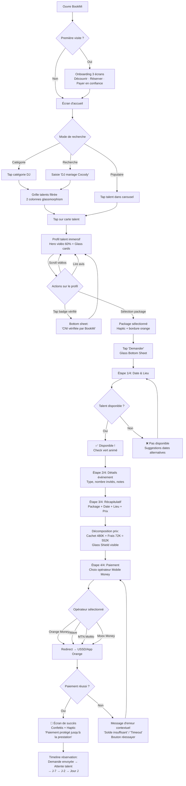
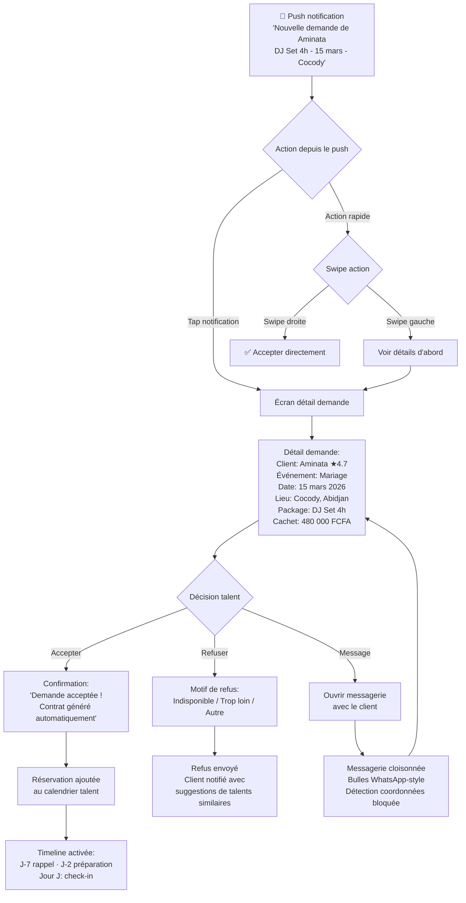
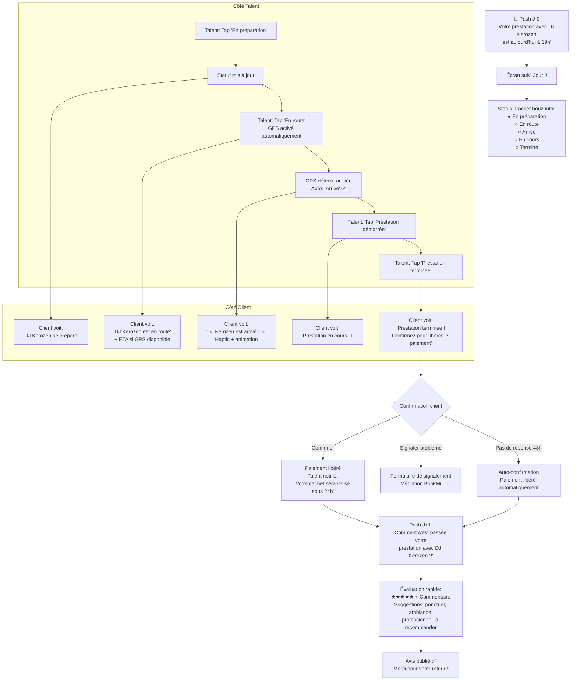
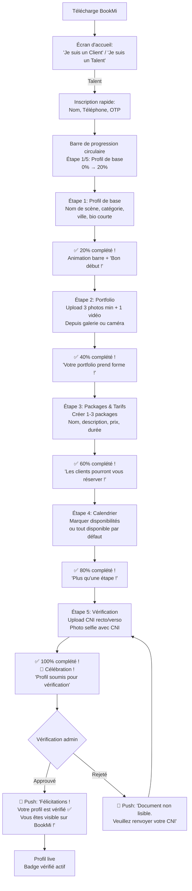

# UX Design Specification BookMi_v2

**Author:** Aboubakarouattara
**Date:** 2026-02-16

---

## Executive Summary

### Project Vision

BookMi est la première marketplace digitale de réservation de talents en Côte d'Ivoire. Elle remplace un marché 100% informel (WhatsApp, Facebook, bouche-à-oreille) par un écosystème de confiance structuré. Du point de vue UX, le défi central est de **créer une expérience suffisamment fluide et premium pour que les utilisateurs abandonnent WhatsApp** — leur outil actuel — au profit de BookMi.

La plateforme comporte **3 espaces distincts** avec des besoins UX spécifiques :
- **Espace Client (mobile-first)** : Découverte, réservation et paiement de talents
- **Espace Talent (mobile + web)** : Gestion de profil, calendrier, finances et réputation
- **Espace Admin (desktop-first)** : Dashboards, validation, litiges et opérations

**Direction visuelle demandée :** Style iOS 16 — glassmorphism (transparences frosted glass), effets glossy, formes très arrondies, éléments encadrés/bordurés, aspect premium et poli. Le design existant (bookmi.vercel.app) servira de base avec une évolution vers cette esthétique.

### Target Users

**1. Aminata — La Cliente (persona principal)**
- 25-45 ans, professionnelle urbaine à Abidjan
- Organise des événements familiaux/professionnels (mariages, anniversaires, corporate)
- Tech-savvy modérée : utilise WhatsApp, Orange Money, Instagram quotidiennement
- **Frustration actuelle :** Fausses pages Facebook, managers opaques, paiements sans garantie, arnaque
- **Besoin UX :** Trouver un talent vérifié et payer en confiance en moins de 10 minutes
- **Device :** Smartphone Android entrée/milieu de gamme (80%), iPhone (20%)

**2. DJ Kerozen — Le Talent**
- Artiste avec 5-15 prestations/mois
- Utilise WhatsApp pour tout coordonner, pas de vision financière claire
- **Frustration actuelle :** Manager qui négocie dans son dos, pas de visibilité sur les revenus réels
- **Besoin UX :** Tableau de bord financier transparent, calendrier efficace, promotion du profil
- **Device :** Smartphone (gestion quotidienne) + web occasionnel

**3. Manager Moussa — Le Manager**
- Gère 1-5 artistes simultanément
- **Besoin UX :** Vue multi-artistes, calendrier unifié, réponse rapide aux demandes — SANS voir les montants
- **Device :** Smartphone principalement

**4. Admin Koné — L'Administrateur**
- CEO/fondateur + équipe (Comptable, Contrôleur, Modérateur)
- **Besoin UX :** Vision globale en 30 secondes, actions rapides sur les litiges/validations
- **Device :** Desktop (laptop) exclusivement

### Key Design Challenges

**1. Confiance visuelle immédiate**
Le frein #1 au marché est la peur de l'arnaque. Chaque écran doit communiquer visuellement la sécurité : badges vérifiés proéminents, indicateurs de séquestre, progression du paiement visible, contrat accessible. Le design glassmorphism avec ses transparences et son aspect premium renforce cette perception de professionnalisme.

**2. Remplacement de WhatsApp comme outil de communication**
Les utilisateurs ivoiriens communiquent exclusivement via WhatsApp. La messagerie BookMi doit être aussi fluide et familière (bulles, vocaux, emojis, photos) tout en étant cloisonnée. Si l'expérience est perçue comme inférieure à WhatsApp, les utilisateurs contourneront.

**3. Performance sur appareils entrée de gamme**
80% des utilisateurs sont sur Android avec 2-3 GB de RAM. Le design glassmorphism (flou, transparences, animations) est gourmand en ressources. Il faudra un équilibre entre esthétique iOS 16 et performance réelle sur Tecno Spark / Samsung A05s. Dégradation gracieuse nécessaire.

**4. Double flux d'inscription (Client vs Talent)**
Deux parcours d'onboarding très différents. Le client veut commencer à chercher immédiatement. Le talent doit remplir un profil riche (bio, portfolio, packages, calendrier) avant d'être visible. L'UX doit rendre ce long parcours talent motivant et guidé.

**5. Rôle Manager — visibilité contrôlée sans frustration**
Le manager ne voit pas les montants. Cette restriction doit être vécue comme naturelle (le design ne montre simplement pas les champs financiers) et non comme une limitation frustrante.

### Design Opportunities

**1. Glassmorphism comme signature visuelle premium**
Le style iOS 16 (transparences, flous, arrondis, glossy) est peu utilisé dans les apps africaines. BookMi peut se démarquer visuellement de toute la concurrence et projeter une image de plateforme haut de gamme — renforçant la confiance. Les cartes talents avec fond transparent sur des images vibrantes créeraient un effet "wow" immédiat.

**2. Check-in jour J comme expérience temps réel engageante**
Le suivi jour J (en préparation → en route → arrivé → en cours → terminé) est une opportunité de créer un moment UX mémorable à la Uber — avec carte, animations de progression, et notifications contextuelles. C'est le moment émotionnel clé de l'expérience BookMi.

**3. Profil talent comme showreel immersif**
Le profil talent peut être conçu comme une expérience visuelle immersive — vidéos en autoplay, galerie plein écran, avis intégrés dans un scroll fluide. Avec le glassmorphism, les éléments flottants (badge vérifié, note, prix) sur fond de vidéo/photo créeraient un effet premium distinctif.

**4. Dashboard financier talent — le moment "aha"**
Le dashboard où le talent voit exactement ce que chaque client a payé est le moment de conversion clé (Journey 3 - DJ Kerozen). Le design de ce dashboard doit être visuellement satisfaisant — graphiques clairs, montants gros et lisibles, comparaisons visuelles évidentes.

**5. Onboarding gamifié pour les talents**
Le parcours d'inscription talent est long (profil, portfolio, packages, calendrier, vérification). Une progression visuelle avec étapes numérotées, barre de progression circulaire, et récompenses visuelles à chaque étape (badge, animation) transformerait une corvée en une expérience motivante.

## Core User Experience

### Defining Experience

**L'action fondamentale de BookMi :** La boucle de confiance `Chercher → Vérifier → Réserver → Payer → Vivre → Évaluer`.

Chaque côté de la marketplace a sa propre action critique :

| Utilisateur | Action critique | Ce qui doit être parfait |
|---|---|---|
| **Client** | Trouver et réserver un talent vérifié | La transition recherche → profil → réservation → paiement doit être un flux continu de moins de 10 minutes |
| **Talent** | Consulter le dashboard financier | Le moment "aha" où le talent voit ses vrais revenus — doit être visuellement satisfaisant et immédiatement compréhensible |
| **Manager** | Gérer les demandes rapidement | Valider/refuser une demande en 2 taps maximum depuis la notification |
| **Admin** | Avoir la vision globale | Dashboard = santé de la plateforme en 30 secondes, action en 1 clic |

**La boucle produit :** Si la réservation client est fluide → le talent reçoit son cachet intact → le talent fait la promotion de BookMi → de nouveaux clients arrivent. Tout commence par la fluidité de la première réservation.

### Platform Strategy

**Architecture multi-plateforme :**

| Plateforme | Utilisateurs | Priorité | Approche |
|---|---|---|---|
| **Mobile Flutter (iOS + Android)** | Clients + Talents + Managers | Primaire | Touch-first, glassmorphism, offline partiel |
| **Web Admin (Laravel Blade)** | Admin CEO + Comptable + Contrôleur + Modérateur | Secondaire | Desktop-first, data-dense, efficace |
| **Web Public (Laravel SSR)** | Visiteurs (SEO) | Tertiaire | Profils publics talents, annuaire, SEO |

**Décisions plateforme :**
- **Mobile-first pour Client et Talent** : 75%+ du trafic CI est mobile. L'app Flutter est l'expérience principale.
- **Desktop-first pour Admin** : Les admins travaillent sur laptop, besoin de vue d'ensemble et de tableaux de données.
- **Web public pour le SEO** : Les profils talents (`bookmi.ci/dj-kerozen`) doivent être indexables par Google pour l'acquisition organique.
- **Offline partiel mobile** : Réservations confirmées, calendrier, messages déjà chargés — accessibles sans connexion.
- **Capacités device exploitées** : Caméra (upload CNI/portfolio), GPS (géolocalisation recherche + check-in jour J), Push notifications (cycle de vie réservation).

### Effortless Interactions

**Ce qui doit être complètement naturel et sans friction :**

**1. Recherche → Profil → Réservation (Client)**
- Le client filtre, tape sur un profil, scrolle les vidéos/avis, choisit un package, et envoie sa demande — sans jamais "réfléchir" à comment faire. Flow inspiré d'Instagram (découverte) + Airbnb (réservation).

**2. Paiement Mobile Money (Client)**
- Tap sur "Payer" → choix de l'opérateur (Orange Money, Wave, MTN, Moov) → validation USSD/app opérateur → confirmation. Le tout en < 15 secondes. L'utilisateur ne doit jamais se demander "est-ce que mon paiement a fonctionné ?" — feedback visuel immédiat à chaque étape.

**3. Réponse aux demandes (Talent/Manager)**
- Notification push → tap → écran de la demande (date, lieu, package) → bouton Accepter/Refuser. 2 taps du push à l'action. Le talent ne doit jamais ouvrir l'app pour chercher une demande.

**4. Check-in jour J (Talent)**
- Notification "Votre prestation est dans 2h" → tap → "Je suis en route" → le GPS confirme l'arrivée automatiquement. Zéro formulaire, zéro saisie manuelle.

**5. Évaluation post-prestation (Client)**
- Push J+1 → tap → étoiles + commentaire rapide → envoi. Moins de 60 secondes. Pré-remplissage intelligent (suggestions de mots : "ponctuel", "ambiance", "professionnel").

**Ce qui doit être automatique (sans intervention utilisateur) :**
- Génération du contrat après paiement
- Rappels J-7 et J-2
- Confirmation automatique 48h après prestation si le client ne répond pas
- Versement au talent 24h après confirmation
- Attribution automatique du niveau talent (Nouveau → Elite)
- Détection des échanges de coordonnées dans les messages

### Critical Success Moments

**Moments "make or break" de l'expérience :**

| Moment | Utilisateur | Ce qui se passe | Si réussi | Si échoué |
|---|---|---|---|---|
| **Premier profil vérifié vu** | Client | Il voit le badge, les vidéos, les avis, le score | "C'est professionnel, je peux faire confiance" | "C'est comme Facebook, pas fiable" |
| **Premier devis transparent** | Client | Il voit : cachet 480K + frais BookMi 72K = 552K | "C'est clair, pas de surprise" | "C'est trop cher" ou "C'est louche" |
| **Premier paiement Mobile Money** | Client | Il paie via Orange Money, reçoit confirmation | "Mon argent est en sécurité" | "J'ai payé mais rien ne se passe" |
| **Check-in jour J** | Client | Il voit "Serge est en route", puis "Serge est arrivé" | Soulagement, zéro stress | Anxiété, perte de confiance |
| **Moment "aha" du dashboard** | Talent | Il voit ses vrais revenus pour la première fois | "Avant je ne savais pas ce que les clients payaient" | Dashboard confus, pas d'impact émotionnel |
| **Première notification de demande** | Talent | Il reçoit sa première réservation via BookMi | "La plateforme fonctionne, je vais en avoir d'autres" | "Ça fait 3 semaines et rien" |
| **Cachet reçu en 24h** | Talent | Orange Money/Wave : montant exact reçu | "Mon cachet est intact, c'est rapide" | Délai ou montant incorrect = perte de confiance |

### Experience Principles

**5 principes directeurs pour toutes les décisions UX de BookMi :**

**1. Confiance d'Abord (Trust-First Design)**
Chaque écran, chaque interaction doit communiquer la sécurité et la fiabilité. Badges vérifiés visibles, états de l'escrow affichés, progression du processus transparente. En cas de doute sur une décision design, choisir l'option qui renforce la confiance.

**2. Familiarité WhatsApp (Zero Learning Curve)**
Les patterns d'interaction doivent être immédiatement reconnaissables pour un utilisateur de WhatsApp et Orange Money. Bulles de message, listes scrollables, boutons d'action proéminents. L'utilisateur ne doit jamais se demander "comment ça marche ?".

**3. Transparence Totale (Show Everything)**
Montrer chaque étape, chaque montant, chaque statut. Pas de "boîtes noires". Le devis décompose cachet + frais. Le dashboard montre chaque transaction. Le check-in montre chaque statut. La transparence EST le produit.

**4. Mobile-First Performance (Speed Over Polish)**
L'esthétique glassmorphism est importante, mais la vitesse prime. Sur un Tecno Spark avec 3G, l'app doit être utilisable. Dégradation gracieuse : si le GPU ne supporte pas le flou, fallback vers des fonds semi-transparents. Les animations sont des bonus, pas des prérequis.

**5. Premium Accessible (Luxury for Everyone)**
Le design glassmorphism/iOS 16 projette une image haut de gamme, mais l'expérience doit rester accessible. Textes lisibles, boutons larges (min 44px), zones de tap généreuses, messages d'erreur en français clair. Le premium ne signifie pas l'exclusion.

## Desired Emotional Response

### Primary Emotional Goals

| Émotion primaire | Pour qui | Moment clé | Pourquoi c'est critique |
|---|---|---|---|
| **Sécurité / Sérénité** | Client | Tout le parcours de réservation | L'arnaque est le frein #1 — l'utilisateur doit sentir que son argent est protégé à chaque instant |
| **Fierté / Empowerment** | Talent | Dashboard financier + premier cachet reçu | "Je vois enfin ce que je vaux vraiment" — le moment de libération vis-à-vis du système opaque |
| **Efficacité / Contrôle** | Manager | Gestion multi-artistes | "Je suis un professionnel avec des outils professionnels" — pas un intermédiaire limité |
| **Maîtrise / Confiance** | Admin | Dashboard global | "Ma plateforme tourne bien, j'ai le contrôle" — vision claire = sérénité opérationnelle |

**L'émotion qui fait la différence :** BookMi doit créer un sentiment de **confiance premium** — le sentiment qu'on utilise un service professionnel, structuré, et que "les choses sérieuses se passent ici, pas sur WhatsApp".

### Emotional Journey Mapping

**Parcours émotionnel du Client :**

| Étape | Émotion actuelle (sans BookMi) | Émotion cible (avec BookMi) | Levier UX |
|---|---|---|---|
| Recherche d'artiste | Frustration, méfiance (fausses pages) | Curiosité, découverte, émerveillement | Glassmorphism, profils immersifs, vidéos |
| Consultation profil | Doute ("Est-ce le vrai ?") | Confiance ("Badge vérifié, 47 avis, vidéos de vrais événements") | Badge proéminent, preuve sociale, score fiabilité |
| Devis / Prix | Anxiété ("Combien ça va me coûter vraiment ?") | Clarté, transparence ("Je vois chaque ligne") | Décomposition visuelle cachet + frais |
| Paiement | Peur ("Et si je me fais arnaquer ?") | Sécurité ("Mon argent est en séquestre") | Indicateur escrow animé, confirmation immédiate |
| Attente J-J | Stress ("Et s'il ne vient pas ?") | Sérénité ("Il est en route, je vois sa progression") | Tracker temps réel à la Uber |
| Prestation | Joie (si réussie) / Colère (si échec) | Joie amplifiée / Soulagement (protection garantie) | Check-in, signalement 1-tap |
| Post-prestation | Indifférence | Satisfaction, envie de partager | Évaluation gamifiée, partage social |

**Parcours émotionnel du Talent :**

| Étape | Émotion actuelle (sans BookMi) | Émotion cible (avec BookMi) | Levier UX |
|---|---|---|---|
| Inscription | Scepticisme ("Encore une app...") | Motivation ("Mon profil officiel, enfin !") | Onboarding gamifié, barre de progression |
| Profil complété | Pas applicable | Fierté ("Mon showreel professionnel") | Profil preview, lien partageable |
| Première demande | Pas applicable | Excitation ("Ça marche !") | Notification riche avec détails événement |
| Dashboard financier | Opacité ("Mon manager gère...") | Révélation, empowerment ("JE vois tout") | Montants grands, graphiques clairs, comparaisons |
| Cachet reçu | Dépendance du manager | Autonomie, satisfaction | Notification + montant exact affiché |
| Niveau atteint | Pas applicable | Fierté, reconnaissance | Animation célébration, badge visuel |

### Micro-Emotions

**Émotions à cultiver à chaque interaction :**

| Micro-émotion | Contexte | Design approach |
|---|---|---|
| **Assurance** | Chaque écran impliquant de l'argent | Icône de bouclier/cadenas, couleurs stables (bleu/vert), progress bars |
| **Reconnaissance** | Talent reconnu pour sa qualité | Badges niveaux animés, "Top talent du mois", étoiles brillantes |
| **Impatience positive** | Attente de la réponse du talent | "Généralement répond en 4h", indicateur de temps de réponse |
| **Soulagement** | Paiement confirmé, remboursement effectué | Animation de check vert, message rassurant en gros |
| **Appartenance** | Membre de l'écosystème BookMi | "Bienvenue dans la communauté", compteur de talents/clients |
| **Surprise agréable** | Moments inattendus de qualité | Micro-animations, transitions fluides, détails soignés du glassmorphism |

**Émotions à éviter absolument :**

| Émotion négative | Contexte à risque | Prévention UX |
|---|---|---|
| **Méfiance** | Processus de paiement opaque | Toujours montrer où est l'argent (séquestre → versement) |
| **Confusion** | Navigation, statuts de réservation | Labels clairs en français, pas de jargon technique, stepper visuel |
| **Frustration** | Formulaires longs, chargement lent | Progression visible, sauvegarde auto, skeleton screens |
| **Abandon** | Inscription talent trop longue | Étapes numérotées, "encore 2 étapes", sauvegarde brouillon |
| **Anxiété** | Jour J sans nouvelles du talent | Statuts temps réel obligatoires, fallback "Contactez le support" |
| **Injustice** | Manager qui ne voit pas les montants | Ne pas montrer de champs masqués — l'interface manager est simplement différente, pas amputée |

### Design Implications

**Connexions Émotion → Design :**

**1. Sécurité → Glass Shield Pattern**
Les éléments financiers (escrow, paiement, versement) utilisent un pattern visuel cohérent : fond glassmorphism avec bordure subtile bleu/vert, icône de bouclier, et barre de progression. Ce "glass shield" devient le signal visuel universel de "votre argent est protégé".

**2. Fierté → Celebration Moments**
Chaque accomplissement (badge vérifié obtenu, nouveau niveau, première réservation) déclenche une micro-animation de célébration — confettis subtils, pulse lumineux, haptic feedback. Ces moments renforcent l'attachement émotionnel à la plateforme.

**3. Transparence → Progressive Disclosure**
Les montants et les statuts ne sont jamais cachés mais révélés progressivement. Le devis s'affiche ligne par ligne avec une animation douce. Le dashboard charge d'abord le montant total (gros), puis les détails (scroll). L'information arrive dans l'ordre émotionnel optimal.

**4. Premium → Glassmorphism Cohérent**
Le style iOS 16 (transparences, flous, reflets, arrondis) est appliqué uniformément. Les cartes sont semi-transparentes avec blur sur des fonds colorés. Les boutons ont un effet glossy subtil. Les transitions sont fluides (300ms ease-out). Cela crée une sensation constante de qualité — chaque écran "sent" le premium.

**5. Familiarité → WhatsApp Patterns**
La messagerie utilise exactement les mêmes patterns que WhatsApp : bulles à droite (envoyé) / gauche (reçu), icônes check/double-check, zone de saisie en bas avec bouton micro. L'utilisateur n'a rien à apprendre.

### Emotional Design Principles

**1. Rassurer avant d'engager**
Montrer la sécurité (badge, escrow, contrat) AVANT de demander une action (payer, réserver). Ne jamais demander de l'argent sans avoir d'abord montré les garanties.

**2. Célébrer chaque progression**
Chaque étape franchie mérite un feedback visuel positif. Même un profil rempli à 60% mérite un "Bon début !" avec la barre qui progresse. Les micro-célébrations créent des habitudes.

**3. Humaniser les erreurs**
Quand quelque chose ne fonctionne pas, le message doit être humain et en français courant. Pas "Erreur 500" mais "Oups, un souci de connexion. Réessayez dans quelques secondes." Avec une suggestion d'action claire.

**4. Le silence est anxiogène**
Ne jamais laisser l'utilisateur sans information. Pendant le paiement : spinner + texte "Connexion à Orange Money en cours...". Pendant l'attente de réponse du talent : "Généralement répond en 4h". Pendant le jour J : statuts temps réel obligatoires.

**5. Le premium est dans les détails**
Le glassmorphism seul ne suffit pas. La qualité se perçoit dans les micro-interactions : le rebond d'un bouton au tap, la transition fluide entre les écrans, le flou qui s'ajuste au scroll, le haptic feedback sur les actions critiques. Ces détails invisibles créent le sentiment de "c'est bien fait".

## UX Pattern Analysis & Inspiration

### Inspiring Products Analysis

**1. Airbnb — La référence marketplace de réservation**

| Aspect | Ce qu'ils font brillamment | Pertinence pour BookMi |
|---|---|---|
| **Découverte visuelle** | Photos plein écran, scroll vertical infini, filtres contextuels | Profils talents avec vidéos/photos immersives |
| **Confiance par la preuve sociale** | Superhost badge, 4.92 (1,247 avis), photo hôte + réponse | Badge vérifié, score fiabilité, avis structurés |
| **Transparence tarifaire** | Décomposition nuit + frais de service + taxes avant paiement | Cachet + frais BookMi 15% affichés clairement |
| **Flow de réservation** | Découverte → Profil → Dates → Paiement en 4 écrans max | Recherche → Profil talent → Package → Paiement |
| **Gestion des annulations** | Politique claire affichée avant réservation, remboursement automatique | Politique J-14/J-7/J-2 visible dès la page de réservation |

**Ce qui fait la différence :** La transition entre "je regarde" et "je réserve" est imperceptible. L'utilisateur ne sent jamais de rupture. Les photos font le travail de conviction — le texte est secondaire.

---

**2. Uber — Le modèle de suivi temps réel**

| Aspect | Ce qu'ils font brillamment | Pertinence pour BookMi |
|---|---|---|
| **Tracking temps réel** | Carte avec position du chauffeur, ETA en direct, statuts progressifs | Check-in jour J : "en préparation → en route → arrivé → en cours" |
| **Paiement invisible** | Paiement automatique à la fin, pas de friction | Mobile Money en 1 tap, confirmation immédiate |
| **Évaluation post-course** | 5 étoiles immédiatement à l'arrivée, 1 tap | Évaluation post-prestation en < 60 secondes |
| **Notifications contextuelles** | "Votre chauffeur arrive dans 3 min" | "DJ Serge est en route vers Cocody" |
| **Feedback d'état** | Animation voiture en mouvement sur la carte | Animation progression prestation jour J |

**Ce qui fait la différence :** Le suivi temps réel transforme l'anxiété en contrôle. L'utilisateur ne se demande jamais "où en est-on ?". BookMi doit reproduire exactement ce sentiment pour le jour J.

---

**3. WhatsApp — La familiarité absolue**

| Aspect | Ce qu'ils font brillamment | Pertinence pour BookMi |
|---|---|---|
| **Messagerie intuitive** | Bulles droite/gauche, check/double-check, zone de saisie bas | Messagerie cloisonnée BookMi — mêmes patterns |
| **Audio rapide** | Maintenir pour enregistrer, relâcher pour envoyer | Messages vocaux dans la messagerie talent↔client |
| **Statuts de lecture** | Envoyé → Reçu → Lu (coches grises → bleues) | Statuts de message dans la messagerie BookMi |
| **Partage média** | Photo/vidéo intégrés naturellement dans la conversation | Partage portfolio/photos événement dans les échanges |
| **Notifications** | Badge rouge avec compteur, preview du message | Notifications demandes/messages avec preview |

**Ce qui fait la différence :** 97% des utilisateurs internet en CI utilisent WhatsApp. Le coût d'apprentissage de la messagerie BookMi doit être ZÉRO. Chaque pattern qui dévie de WhatsApp crée une friction cognitive.

---

**4. Instagram — La découverte visuelle immersive**

| Aspect | Ce qu'ils font brillamment | Pertinence pour BookMi |
|---|---|---|
| **Feed visuel** | Grille 3 colonnes, tap → image plein écran, scroll vertical | Grille portfolio talent, galerie plein écran |
| **Stories / Reels** | Vidéos courtes verticales, autoplay, swipe | Vidéos de prestations sur profils talents |
| **Profil comme portfolio** | Bio + grille + highlights + statistiques | Profil talent = bio + showreel + packages + avis |
| **Exploration** | Onglet Explorer avec catégories, recommandations IA | Page découverte talents par catégorie/localisation |
| **Social proof** | Nombre de followers visible, likes, commentaires | Nombre de prestations, note, avis récents |

**Ce qui fait la différence :** Instagram a prouvé que les visuels vendent mieux que le texte. Les profils talents BookMi doivent être des mini-pages Instagram — la vidéo et la photo en premier, les détails textuels en second.

---

**5. Apple Music / iOS 16 — L'esthétique glassmorphism de référence**

| Aspect | Ce qu'ils font brillamment | Pertinence pour BookMi |
|---|---|---|
| **Glassmorphism** | Cartes semi-transparentes avec blur sur fond coloré dynamique | Cartes talents sur fond de leur photo/vidéo principale |
| **Dynamic Island / Live Activities** | Informations contextuelles flottantes, animations fluides | Suivi jour J en notification persistante |
| **Typographie** | SF Pro — grande, lisible, hiérarchie claire (titre XXL, corps M) | Hiérarchie typographique nette : montants gros, labels petits |
| **Animations** | Spring animations, parallax, transitions fluides 300ms | Transitions entre écrans, micro-animations sur actions |
| **Couleurs adaptatives** | Palette extraite de l'image d'arrière-plan | Couleur d'accent adaptée à la catégorie talent (musique=violet, DJ=bleu) |

**Ce qui fait la différence :** Apple a démocratisé le glassmorphism. Les utilisateurs iPhone reconnaissent immédiatement cette esthétique comme "premium". Sur Android, c'est perçu comme "iOS-like" = premium. C'est exactement le positionnement que BookMi veut projeter.

### Transferable UX Patterns

**Patterns de Navigation :**

| Pattern | Source | Application BookMi | Bénéfice |
|---|---|---|---|
| **Bottom Tab Navigation** | Instagram, Uber | 4-5 tabs : Accueil, Recherche, Messages, Profil (+Réservations) | Navigation familière, accès 1-tap aux sections clés |
| **Pull-to-Refresh** | Instagram, WhatsApp | Listes de talents, messages, notifications | Geste naturel pour mettre à jour |
| **Swipe-to-Action** | WhatsApp, Mail | Swipe sur une demande pour Accepter/Refuser | Action rapide sans ouvrir le détail |
| **Sticky Header + Scroll** | Airbnb, Instagram | Profil talent : header photo fixe, détails qui scrollent dessous | Contexte visuel toujours visible pendant l'exploration |
| **Bottom Sheet Modal** | Apple Maps, Uber | Détail package, sélection date, confirmation paiement | Modal non-intrusif, accès facile au pouce |

**Patterns d'Interaction :**

| Pattern | Source | Application BookMi | Bénéfice |
|---|---|---|---|
| **Stepper de progression** | Uber (réservation), Airbnb | Flow de réservation en 4 étapes visuelles | L'utilisateur sait toujours où il en est |
| **Skeleton Screens** | Facebook, Instagram | Chargement profils, listes, dashboard | Perception de rapidité vs spinner rotatif |
| **Haptic Feedback** | iOS natif, Apple Pay | Confirmation paiement, action critique | Confirmation sensorielle des actions importantes |
| **Smart Suggestions** | Instagram (commentaires) | Évaluation : "ponctuel", "ambiance", "professionnel" | Réduit l'effort de saisie, améliore le taux de complétion |
| **Notification Rich** | Uber, Airbnb | Demande de réservation avec photo talent + détails | Action possible directement depuis la notification |

**Patterns Visuels :**

| Pattern | Source | Application BookMi | Bénéfice |
|---|---|---|---|
| **Glass Card (Glassmorphism)** | iOS 16, Apple Music | Cartes talents, cartes réservation, modals | Esthétique premium, sensation de profondeur |
| **Gradient Background** | Instagram Stories, Spotify | Fonds écrans principaux, headers de profil | Dynamisme visuel, identité de marque forte |
| **Badge System** | Airbnb (Superhost), Uber (Platinium) | Nouveau → Confirmé → Premium → Elite | Gamification visuelle de la progression |
| **Progress Ring** | Apple Watch, Fitness | Onboarding talent (profil 70% complété) | Motivation visuelle à compléter le profil |
| **Floating Action Button** | Google Material | Bouton "Nouvelle réservation" ou "Rechercher" | Action primaire toujours accessible |

### Anti-Patterns to Avoid

| Anti-Pattern | Exemple à éviter | Pourquoi c'est problématique | Alternative BookMi |
|---|---|---|---|
| **Formulaires en cascade** | LinkedIn (inscription 12 écrans) | Taux d'abandon > 70% après l'écran 5 | Onboarding talent en 5 étapes max avec sauvegarde auto |
| **Information overload** | Jumia (pages produit surchargées) | Utilisateur submergé, paralysie décisionnelle | Profil talent épuré : vidéo d'abord, détails en scroll |
| **Hamburger menu** | Apps traditionnelles (≡ en haut à gauche) | Navigation cachée = fonctionnalités oubliées | Bottom tab bar visible en permanence |
| **Confirmation popup abusive** | "Êtes-vous sûr ?" à chaque action | Friction inutile, pattern blindness | Confirmation uniquement pour paiement et annulation |
| **Dark patterns financiers** | Frais cachés révélés au dernier moment | Perte de confiance immédiate et définitive | Décomposition cachet + frais dès la page profil talent |
| **Skeleton → Empty state** | Apps qui montrent des skeletons puis "Aucun résultat" | Frustration de l'attente pour rien | Message "aucun résultat" immédiat si la liste est vide |
| **Notifications non-actionnables** | "Vous avez un nouveau message" sans preview | Oblige à ouvrir l'app pour comprendre | Notification riche avec preview + action directe |
| **Onboarding forcé** | Tutoriels 5 écrans obligatoires au premier lancement | L'utilisateur veut explorer, pas lire | Onboarding contextuel : tips au moment pertinent |
| **Surcharge d'animations** | Apps avec transitions 800ms+ partout | Sensation de lenteur, impatience | Animations 200-300ms max, skip si performance faible |
| **Copier/coller d'interfaces web** | Apps qui sont des webviews déguisées | Manque de fluidité native, transitions saccadées | Flutter natif pour une expérience 60fps |

### Design Inspiration Strategy

**Ce qu'on adopte tel quel :**

| Pattern adopté | Source | Raison |
|---|---|---|
| Bottom tab navigation (5 tabs) | Instagram/Uber | Standard mobile, zéro apprentissage |
| Messagerie bulles + check/double-check | WhatsApp | Familiarité absolue pour les utilisateurs CI |
| Tracking temps réel jour J | Uber | Transforme l'anxiété en contrôle — moment clé BookMi |
| Skeleton screens au chargement | Facebook/Instagram | Perception de rapidité, standard moderne |
| Haptic feedback sur paiement | Apple Pay | Confirmation sensorielle pour les moments critiques |

**Ce qu'on adapte :**

| Pattern adapté | Source | Adaptation BookMi |
|---|---|---|
| Glassmorphism iOS 16 | Apple Music | Adapté avec dégradation gracieuse : blur natif sur devices puissants, fond semi-transparent + opacité sur devices entrée de gamme |
| Profil comme portfolio | Instagram | Adapté avec packages/tarifs intégrés — ce n'est pas juste du contenu mais un catalogue réservable |
| Flow de réservation | Airbnb | Simplifié à 4 étapes max (vs 6-7 chez Airbnb) — le contexte CI exige plus de rapidité |
| Badge system | Airbnb Superhost | Adapté en 4 niveaux (Nouveau → Elite) avec visibilité uniquement, pas de commission réduite |
| Évaluation post-service | Uber | Adaptée avec suggestions textuelles en français + possibilité d'évaluer spécifiquement la ponctualité |

**Ce qu'on évite :**

| Anti-pattern évité | Raison |
|---|---|
| Formulaires longs sans sauvegarde | Les utilisateurs CI ont des connexions intermittentes — chaque champ doit être sauvé automatiquement |
| Hamburger menu | Les fonctions cachées ne sont jamais utilisées — tout doit être à portée de pouce |
| Animations longues non-skippables | Sur Tecno Spark / Samsung A05s, les animations lourdes = gel de l'app |
| Dark patterns tarifaires | La confiance est LE produit de BookMi — tout frais caché détruit la proposition de valeur |
| Copie exacte d'une app existante | BookMi doit avoir sa propre identité visuelle — le glassmorphism + orange/navy = signature unique |

**Principes d'inspiration :**
1. **Airbnb pour le flow** — La transition découverte → réservation → paiement doit être invisible
2. **Uber pour le temps réel** — Le jour J est le moment émotionnel clé, il doit être parfait
3. **WhatsApp pour la familiarité** — Zéro coût d'apprentissage sur la messagerie
4. **Instagram pour le visuel** — Les talents se vendent par l'image, pas par le texte
5. **iOS 16 pour l'esthétique** — Glassmorphism comme signature premium, avec dégradation gracieuse

## Design System Foundation

### Design System Choice

**Approche retenue : Design System Hybride Custom sur Flutter + Tailwind Admin**

BookMi nécessite un design system à deux branches, reflétant ses deux plateformes distinctes :

| Plateforme | Base | Approche | Justification |
|---|---|---|---|
| **Mobile Flutter (Client + Talent + Manager)** | Material Design 3 (Material You) fortement thématisé | Composants Material 3 comme fondation + couche glassmorphism custom | Material 3 offre accessibilité, animations, et responsive built-in. Le theming permet d'atteindre l'esthétique iOS 16 sans tout recoder |
| **Web Admin (Laravel)** | Tailwind CSS + composants custom | Utility-first avec composants admin spécifiques | Desktop-first, data-dense, pas besoin de glassmorphism — priorité à l'efficacité et la lisibilité des données |
| **Web Public SEO (Laravel SSR)** | Tailwind CSS | Pages statiques optimisées SEO, reprenant les codes visuels de l'app | Profils publics, annuaire, landing pages — léger et rapide |

**Pourquoi pas un design system entièrement custom ?**
Un design system from scratch pour Flutter serait un investissement disproportionné pour un MVP. Material 3 avec theming lourd donne 90% du résultat visuel souhaité avec 30% de l'effort. Les composants véritablement custom (glass cards, progress rings, celebration animations) seront développés au-dessus de la couche Material 3.

**Pourquoi pas Cupertino (iOS widgets) dans Flutter ?**
Même si l'esthétique cible est iOS 16, les widgets Cupertino de Flutter sont limités et moins bien maintenus que Material. La communauté Flutter et les packages tiers sont presque exclusivement Material-based. Le glassmorphism iOS 16 sera obtenu par le theming et les composants custom, pas par les widgets Cupertino.

### Rationale for Selection

**1. Material 3 comme fondation Flutter :**

| Critère | Avantage Material 3 | Impact BookMi |
|---|---|---|
| **Accessibilité native** | Contraste automatique, semantics, screen readers | WCAG 2.1 AA respecté sans effort supplémentaire |
| **Système de theming** | ColorScheme, TextTheme, ShapeTheme, ElevationTheme | Les tokens glassmorphism (couleurs, arrondis, transparences) s'intègrent naturellement |
| **Composants prouvés** | NavigationBar, SearchBar, BottomSheet, Cards, Chips | 60%+ des composants BookMi sont des Material 3 thématisés |
| **Animations** | MaterialPageRoute, Hero, AnimatedContainer, Curves | Transitions fluides 300ms out-of-the-box |
| **Responsive** | MediaQuery, LayoutBuilder, adaptive breakpoints | Adaptation smartphone entrée de gamme ↔ tablette |
| **Communauté** | 95% des packages Flutter sont Material-compatible | Intégration sans friction avec l'écosystème |

**2. Couche Glassmorphism Custom :**

| Composant custom | Pourquoi custom | Complexité |
|---|---|---|
| **GlassCard** | Carte semi-transparente avec backdrop blur — n'existe pas dans Material 3 | Moyenne — `BackdropFilter` + `ClipRRect` |
| **GlassAppBar** | AppBar transparente avec blur sur le contenu qui scrolle dessous | Moyenne — `SliverAppBar` + `BackdropFilter` |
| **GlassBottomSheet** | Bottom sheet avec fond frosted glass | Faible — theming du `BottomSheet` Material |
| **ProgressRing** | Anneau de progression circulaire pour l'onboarding talent | Faible — `CustomPainter` |
| **CelebrationOverlay** | Animation confettis/pulse pour les achievements | Faible — package `confetti` + `AnimationController` |
| **GlassShield** | Indicateur escrow/sécurité financière (bouclier + glass) | Moyenne — `CustomPainter` + `BackdropFilter` |
| **StatusTracker** | Stepper horizontal pour le suivi jour J (type Uber) | Moyenne — `CustomPainter` + animations |
| **ChatBubble** | Bulles de messagerie style WhatsApp | Faible — `Container` avec `BoxDecoration` |

**3. Tailwind CSS pour le Web Admin :**

| Critère | Avantage Tailwind | Impact BookMi Admin |
|---|---|---|
| **Utility-first** | Classes atomiques, pas de CSS custom à maintenir | Développement rapide des dashboards et tableaux |
| **Design tokens** | Customisable via `tailwind.config.js` | Même palette de couleurs que l'app mobile |
| **Responsive** | Breakpoints built-in (`sm:`, `md:`, `lg:`) | Adaptation laptop → grand écran |
| **Performance** | Purge CSS, < 10KB en production | Pages admin rapides |
| **Écosystème** | Headless UI, Heroicons, Tailwind Forms | Composants admin prêts à l'emploi |

### Implementation Approach

**Phase 1 — Design Tokens (Sprint 0) :**

```
bookmi_design_system/
├── tokens/
│   ├── colors.dart          # Palette primaire/secondaire/neutres
│   ├── typography.dart      # Hiérarchie typographique
│   ├── spacing.dart         # Grille de spacing (4, 8, 12, 16, 24, 32, 48)
│   ├── radius.dart          # Border radius (8, 12, 16, 24, 999)
│   ├── shadows.dart         # Ombres et élévations
│   └── glassmorphism.dart   # Tokens spécifiques : blur, opacity, border
├── components/
│   ├── glass_card.dart      # Carte glassmorphism réutilisable
│   ├── glass_app_bar.dart   # AppBar transparente
│   ├── glass_bottom_sheet.dart
│   ├── glass_shield.dart    # Indicateur sécurité financière
│   ├── progress_ring.dart   # Anneau de progression
│   ├── celebration_overlay.dart
│   ├── status_tracker.dart  # Stepper jour J
│   └── chat_bubble.dart     # Bulle messagerie WhatsApp-style
├── theme/
│   ├── bookmi_theme.dart    # ThemeData principal
│   ├── bookmi_dark_theme.dart  # Variante dark (future)
│   └── adaptive_glass.dart  # Dégradation gracieuse GPU
└── utils/
    └── device_capability.dart  # Détection capacité device pour fallback
```

**Phase 2 — Dégradation Gracieuse :**

| Capacité device | Rendu glassmorphism | Fallback |
|---|---|---|
| **GPU puissant** (iPhone 12+, Samsung S21+, Pixel 6+) | `BackdropFilter` avec `ImageFilter.blur(sigmaX: 20, sigmaY: 20)` + border semi-transparent | Effet glassmorphism complet |
| **GPU moyen** (Samsung A30s, Xiaomi Redmi Note 10) | `BackdropFilter` avec blur réduit (sigma: 10) + opacité augmentée | Glassmorphism allégé mais visible |
| **GPU faible** (Tecno Spark, Samsung A05s, 2GB RAM) | Pas de `BackdropFilter` — fond coloré semi-transparent (`Color.withOpacity(0.85)`) + border | Effet "glass-like" sans blur, performance préservée |

**Détection :** Basée sur les capacités GPU au runtime via `dart:ui` — le niveau de glassmorphism s'adapte automatiquement sans intervention de l'utilisateur.

**Phase 3 — Composants Admin (Tailwind) :**

| Composant | Usage | Approche |
|---|---|---|
| **DataTable** | Listes talents, réservations, transactions | Tailwind + Alpine.js pour tri/filtre |
| **StatCard** | KPIs dashboard (CA, réservations, litiges) | Tailwind avec icônes Heroicons |
| **ChartContainer** | Graphiques revenus, activité | Container Tailwind + Chart.js |
| **ActionModal** | Validation identité, résolution litige | Headless UI Dialog |
| **FilterBar** | Filtres par date, statut, catégorie | Tailwind + Alpine.js |

### Customization Strategy

**Design Tokens — Palette BookMi (basée sur le logo) :**

| Token | Valeur | Usage |
|---|---|---|
| `brand-navy` | `#1A2744` (Navy "Book" du logo) | Fonds, headers, texte principal |
| `brand-blue` | `#2196F3` (Bleu "Mi" du logo) | Accents de marque, liens, sélections, badges |
| `brand-blue-dark` | `#1976D2` | État pressed/hover du bleu |
| `cta-orange` | `#FF6B35` (Orange CTA) | Boutons d'action : Réserver, Payer, Confirmer |
| `cta-orange-dark` | `#E55A2B` | État pressed/active des CTA |
| `surface` | `rgba(255,255,255,0.15)` | Fond glassmorphism clair |
| `surfaceDark` | `rgba(26,39,68,0.80)` | Fond glassmorphism sombre (navy-based) |
| `success` | `#00C853` | Confirmations, paiement réussi, badge vérifié |
| `warning` | `#FFB300` | Alertes, en attente, modération |
| `error` | `#FF1744` | Erreurs, annulations, litiges |
| `glassBorder` | `rgba(255,255,255,0.25)` | Bordure des éléments glassmorphism |
| `glassBlur` | `20.0` (sigma) | Intensité du backdrop blur |

**Typographie :**

| Niveau | Font | Taille | Weight | Usage |
|---|---|---|---|---|
| **Display** | Nunito | 32px | Bold | Montants dashboard, titres principaux |
| **Headline** | Nunito | 24px | SemiBold | Titres de section, noms de talent |
| **Title** | Nunito | 20px | SemiBold | Sous-titres, labels importants |
| **Body** | Nunito | 16px | Regular | Texte courant, descriptions |
| **Label** | Nunito | 14px | Medium | Labels formulaires, légendes |
| **Caption** | Nunito | 12px | Regular | Métadonnées, timestamps |

**Pourquoi Nunito ?** Le logo BookMi utilise une police arrondie avec des terminaisons douces. Nunito est la police Google Fonts la plus proche — arrondie, lisible, 6+ weights, excellent support français. Elle reflète la personnalité amicale et accessible de la marque.

**Formes et arrondis :**

| Élément | Border Radius | Justification |
|---|---|---|
| Cartes principales (talents, réservations) | 24px | Formes très arrondies = esthétique iOS 16 |
| Boutons CTA | 16px | Arrondis mais distincts des cartes |
| Input fields | 12px | Légèrement arrondis, lisibles |
| Chips / Tags | 999px (pill) | Catégories, filtres, badges |
| Bottom sheet | 24px (top) | Cohérent avec les cartes |
| Avatars | 999px (cercle) | Standard photo de profil |
| Images portfolio | 16px | Arrondis pour le côté premium |

**Spacing Grid :**

Base unit : 4px. Tous les espacements sont des multiples de 4 :
`4 | 8 | 12 | 16 | 24 | 32 | 48 | 64`

## Defining Core Experience

### The Defining Experience

**"Trouve ton artiste vérifié et réserve-le en confiance, en 10 minutes."**

C'est la phrase que les utilisateurs de BookMi diront à leurs amis. Comme :
- **Uber** : "Appelle une voiture en 2 taps"
- **Airbnb** : "Réserve un logement unique n'importe où"
- **Tinder** : "Swipe pour matcher"

**BookMi** : "Tu cherches un DJ, tu vois ses vidéos, tu vois qu'il est vérifié, tu paies — et ton argent est protégé."

Cette phrase contient les 4 piliers de l'expérience :
1. **Découverte** ("tu cherches") — L'entrée dans l'écosystème
2. **Preuve** ("tu vois ses vidéos, tu vois qu'il est vérifié") — La confiance visuelle
3. **Action** ("tu paies") — L'engagement financier
4. **Sécurité** ("ton argent est protégé") — La garantie émotionnelle

**L'interaction qui doit être parfaite :** La transition fluide entre la découverte d'un profil talent et le paiement. Si cette chaîne est cassée à un seul maillon — si l'utilisateur hésite, doute, ou abandonne — BookMi échoue. Tout le reste (messagerie, check-in, dashboard) est secondaire à cette boucle fondamentale.

### User Mental Model

**Comment les utilisateurs résolvent ce problème aujourd'hui :**

| Étape | Solution actuelle (informelle) | Modèle mental de l'utilisateur | Implication UX BookMi |
|---|---|---|---|
| Chercher un artiste | WhatsApp ("tu connais un bon DJ ?"), Facebook, bouche-à-oreille | "Je fais confiance aux recommandations de mes proches" | Les avis et notes BookMi doivent avoir le même poids qu'une recommandation personnelle |
| Vérifier la qualité | Vidéos YouTube/Instagram, réputation informelle | "Si je vois des vidéos de vrais événements, c'est un vrai artiste" | Le portfolio vidéo est la preuve #1 — plus puissant que tout badge |
| Négocier le prix | Appel/WhatsApp avec le manager, négociation informelle | "Le prix est négociable, le manager prend sa part" | BookMi doit montrer un prix transparent et FINAL — la perception "cachet intact" |
| Payer | Cash, Orange Money direct au manager, parfois virement | "Je paie et j'espère que ça se passe bien" | Le séquestre doit être compris comme une PROTECTION, pas comme un intermédiaire |
| Jour J | "J'espère qu'il viendra" — aucun tracking | "Je n'ai aucun contrôle, je stresse" | Le tracking temps réel est la rupture majeure vs l'existant |

**Modèle mental que BookMi doit créer :**

Le passage de : "Je connais quelqu'un qui connaît un artiste"
Vers : "J'ouvre BookMi, je choisis, je paie, c'est sécurisé"

**Métaphore familière :** BookMi est pour les artistes ce qu'Uber est pour les taxis — la version organisée, transparente et sécurisée d'un marché informel. Cette métaphore doit être implicite dans chaque interaction UX.

**Points de confusion anticipés :**

| Point de confusion | Pourquoi | Solution UX |
|---|---|---|
| "C'est quoi le séquestre ?" | Concept financier non familier | Ne jamais utiliser le mot "séquestre" — dire "Votre paiement est protégé jusqu'à la prestation" avec un visuel de coffre-fort/bouclier |
| "Pourquoi je ne peux pas appeler l'artiste ?" | L'habitude est le contact direct | Expliquer en onboarding : "Pour votre sécurité, tous les échanges se font via BookMi" — la messagerie doit être SI bonne que l'utilisateur n'a pas envie d'aller sur WhatsApp |
| "Les frais BookMi, c'est quoi ?" | Commission = méfiance | Afficher clairement : "Cachet artiste : 480 000 FCFA (100% pour l'artiste) + Frais de service BookMi : 72 000 FCFA = Total : 552 000 FCFA". Le mot "service" > "commission" |
| "Et si l'artiste annule ?" | Peur de perte financière | Afficher la politique de protection AVANT le paiement — pas en petit en bas de page |
| "Comment je sais que c'est un vrai artiste ?" | Méfiance Internet | Badge "Identité Vérifiée" avec explication au tap : "CNI vérifiée par l'équipe BookMi" |

### Success Criteria

**L'expérience core est réussie quand :**

| Critère | Métrique | Seuil de succès |
|---|---|---|
| **Temps découverte → paiement** | Durée du premier parcours complet | < 10 minutes pour un nouveau client |
| **Taux de conversion profil → demande** | % de visiteurs d'un profil qui envoient une demande | > 15% (benchmark marketplace : 5-10%) |
| **Taux d'abandon paiement** | % d'utilisateurs qui quittent à l'étape paiement | < 20% (benchmark e-commerce CI : 40-60%) |
| **Compréhension du séquestre** | % d'utilisateurs qui comprennent la protection | > 80% sans aide (test utilisabilité) |
| **Score de confiance premier parcours** | NPS après première réservation complétée | > 50 |
| **Taux de réservation répétée** | % de clients qui réservent une 2e fois dans les 3 mois | > 30% |

**Ce qui fait dire "ça marche" à chaque type d'utilisateur :**

| Utilisateur | Moment "ça marche" | Ce qu'il ressent |
|---|---|---|
| **Client** | Il voit le badge vérifié + les vidéos + le prix transparent | "C'est professionnel, c'est pas du Facebook" |
| **Client** | Il reçoit la confirmation instantanée après paiement Mobile Money | "Mon argent est en sécurité, je suis tranquille" |
| **Talent** | Il voit la notification de demande avec tous les détails | "Les clients viennent à moi, je n'ai plus à chercher" |
| **Talent** | Il reçoit son cachet 24h après la prestation | "Mon argent est intact, c'est rapide" |
| **Manager** | Il accepte une demande en 2 taps depuis le push | "C'est efficace, je gère bien mes artistes" |

### Novel UX Patterns

**Analyse : Patterns établis vs. innovations BookMi**

BookMi combine principalement des patterns établis dans un contexte nouveau (marketplace de talents en Afrique de l'Ouest). L'innovation est dans la combinaison, pas dans les patterns individuels.

**Patterns établis que BookMi adopte :**

| Pattern | Source prouvée | Adaptation BookMi |
|---|---|---|
| Recherche par filtres + grille visuelle | Airbnb, Instagram | Standard — les utilisateurs savent chercher |
| Profil détaillé avec preuve sociale | Airbnb, LinkedIn | Vidéos + avis + badge vérifié |
| Checkout en étapes (stepper) | E-commerce mondial | 4 étapes : Package → Date → Récap → Paiement |
| Messagerie in-app | WhatsApp (familiarité) | Bulles + vocaux + médias |
| Push notifications actionnables | Uber, WhatsApp | Demande reçue → Accepter/Refuser |
| Évaluation post-service | Uber, Airbnb | 5 étoiles + commentaire + suggestions |

**Innovations BookMi (combinaisons nouvelles) :**

| Innovation | Description | Pourquoi c'est nouveau |
|---|---|---|
| **Glass Shield Pattern** | Indicateur visuel glassmorphism de protection financière à chaque étape (séquestre visible) | Aucune app en Afrique ne rend le concept d'escrow visuellement tangible |
| **Tracker Jour J** | Suivi temps réel de la prestation : "en préparation → en route → arrivé → en cours → terminé" | Uber pour les événements — n'existe pas dans les marketplaces de talents |
| **Dashboard transparence financière** | Le talent voit EXACTEMENT ce que le client a payé, montant par montant | Rupture totale avec l'opacité du système manager actuel |
| **Onboarding gamifié talent** | Inscription en 5 étapes avec barre circulaire, badges, et "profil preview" à chaque étape | Les marketplaces de talents ont des formulaires ennuyeux — BookMi en fait une expérience |
| **Dégradation glassmorphism adaptative** | Le niveau de glassmorphism s'ajuste automatiquement au GPU du device | Aucune app en CI ne fait de dégradation gracieuse GPU-aware |

**Comment on enseigne les patterns nouveaux :**

| Pattern nouveau | Méthode d'apprentissage | Moment |
|---|---|---|
| Glass Shield (séquestre) | Animation d'onboarding : "Votre argent est protégé" + icône bouclier qui pulse | Première visite de la page paiement |
| Tracker Jour J | Tooltip au premier tracking : "Suivez la prestation en direct" | Première prestation comme client |
| Dashboard transparence | "Nouveauté !" badge sur le premier montant visible | Premier accès au dashboard talent |

### Experience Mechanics

**Flow détaillé de l'interaction core : Découverte → Réservation → Paiement**

**1. INITIATION — L'utilisateur entre dans BookMi**

| Déclencheur | Action utilisateur | Réponse système |
|---|---|---|
| Ouverture de l'app | L'utilisateur arrive sur l'écran d'accueil | Affichage : barre de recherche proéminente + catégories visuelles (cards glassmorphism avec icônes) + "Talents populaires" (carousel horizontal) |
| Tap sur une catégorie | Sélection "DJ", "Groupe Musical", "Humoriste"... | Transition fluide vers la grille de talents filtrée, skeleton screens pendant le chargement |
| Saisie dans la recherche | Tape "DJ mariage Cocody" | Suggestions temps réel (debounce 300ms), résultats filtrés instantanément |

**Design :** L'écran d'accueil est une invitation à explorer — pas un formulaire à remplir. Les catégories sont des glass cards avec icônes et fonds colorés semi-transparents. La barre de recherche est en haut, large, avec placeholder "Quel talent cherchez-vous ?"

---

**2. INTERACTION — L'utilisateur explore un profil**

| Étape | Action utilisateur | Réponse système | Feedback visuel |
|---|---|---|---|
| Tap sur un talent | L'utilisateur tape sur une carte talent | Transition Hero animation : la carte s'agrandit en profil plein écran | Animation fluide 300ms, la photo de la carte devient le header |
| Scroll vidéos | L'utilisateur scrolle les vidéos/photos | Autoplay des vidéos en mode muet, tap pour activer le son | Indicateur play/pause, compteur vues |
| Lecture des avis | L'utilisateur scrolle les avis vérifiés | Avis avec photo du client, note, date, type d'événement | Badge "Avis vérifié" (lié à une réservation réelle) |
| Consultation packages | L'utilisateur voit les 2-3 packages proposés | Cards glassmorphism avec nom, description, prix, durée | Le package recommandé est mis en avant (bordure orange) |
| Vérification badge | L'utilisateur tape sur le badge "Vérifié" | Bottom sheet : "Identité vérifiée par BookMi — CNI validée le 15/01/2026" | Animation pulse sur le badge, bottom sheet glass |

**Design :** Le profil est une expérience immersive. La vidéo/photo principale occupe 60% de l'écran en haut. Le badge vérifié flotte en glassmorphism sur la photo (coin supérieur droit). Le scroll révèle progressivement : vidéos → packages → avis → informations. Les éléments financiers (prix des packages) apparaissent sur des glass cards avec fond `surfaceDark`.

---

**3. FEEDBACK — L'utilisateur s'engage**

| Étape | Action utilisateur | Réponse système | Feedback visuel |
|---|---|---|---|
| Sélection package | Tap sur "DJ Set 4h — 480 000 FCFA" | Le package s'anime (léger zoom + bordure orange), bouton "Demander" apparaît en bas | Haptic feedback léger |
| Tap "Demander" | L'utilisateur initie la réservation | Bottom sheet de réservation : date, lieu, détails événement | Glass bottom sheet avec stepper 4 étapes (1/4 active) |
| Saisie date/lieu | L'utilisateur remplit date et lieu | Vérification calendrier talent en temps réel : "Disponible !" ou "Pas disponible ce jour" | Check vert animé si disponible, suggestion de dates alternatives si non |
| Récapitulatif | L'utilisateur voit le récap complet | Affichage détaillé : Package + Date + Lieu + Décomposition prix (cachet 480K + frais 72K = 552K) + Politique d'annulation | Glass card avec Glass Shield (bouclier) à côté du montant |
| Tap "Payer" | L'utilisateur confirme le paiement | Choix opérateur Mobile Money : Orange Money, Wave, MTN MoMo, Moov Money | 4 boutons avec logos opérateurs, celui détecté en premier |

---

**4. COMPLETION — L'utilisateur est sécurisé**

| Étape | Action utilisateur | Réponse système | Feedback visuel |
|---|---|---|---|
| Validation Mobile Money | L'utilisateur valide sur l'app de son opérateur | Spinner : "Connexion à Orange Money..." → "Paiement en cours..." → "Confirmé !" | Progression 3 états avec texte contextuel, pas un spinner vide |
| Confirmation | — (automatique) | Écran de succès : check animé, "Votre réservation est confirmée !", récap avec numéro de contrat | Animation celebration (confettis subtils), haptic success |
| Contrat généré | — (automatique) | "Votre contrat est disponible" — lien vers le PDF | Notification dans la timeline de la réservation |
| Prochaines étapes | L'utilisateur voit ce qui va suivre | "En attente de confirmation du talent" → timeline avec J-7, J-2, Jour J | Stepper vertical avec les prochaines étapes datées |

**Design du moment de complétion :** C'est le moment le plus important de tout BookMi. L'écran de confirmation doit créer un sentiment de SOULAGEMENT et de CONFIANCE. Le message "Votre paiement est protégé jusqu'à la prestation" est affiché en gros avec le Glass Shield. L'animation de célébration (confettis bleu et navy) dure 2 secondes. Le haptic feedback est fort et satisfaisant. L'utilisateur doit quitter cet écran en pensant : "Mon argent est en sécurité".

## Visual Design Foundation

### Brand Identity — Logo Analysis

**Logo BookMi :** Logotype bicolore "BookMi" sans symbole additionnel.

| Élément | Caractéristique | Valeur extraite |
|---|---|---|
| **"Book"** | Navy foncé, bold, arrondi | `#1A2744` (Navy BookMi) |
| **"Mi"** | Bleu vif, bold, arrondi | `#2196F3` (Bleu BookMi) |
| **Police logo** | Sans-serif arrondie, bold, friendly | Style Nunito/Quicksand — formes douces, terminaisons arrondies |
| **Point du "i"** | Légèrement élargi, playful | Détail de marque distinctif — à reprendre dans les micro-interactions |
| **Fond** | Neutre clair | Utilisable sur fond blanc, clair, ou glassmorphism |

**Règles d'utilisation du logo :**

| Règle | Détail |
|---|---|
| **Espace de protection** | Minimum = hauteur du "i" autour du logo en padding |
| **Taille minimum** | 80px de largeur (mobile), 120px (desktop) |
| **Fond autorisé** | Blanc, gris clair (#F5F5F5+), glassmorphism clair, navy foncé (logo inversé blanc+bleu) |
| **Fond interdit** | Images complexes sans overlay, fond orange/vert/rouge |
| **Version sombre** | "Book" en blanc + "Mi" en bleu vif `#2196F3` — sur fonds sombres/navy |
| **Version monochrome** | Blanc total — pour les watermarks, fonds photo |

**Impact sur la charte : le bleu `#2196F3` du logo devient la couleur de marque primaire.** L'orange (`#FF6B35`) du site actuel est conservé exclusivement comme couleur d'action (CTA). Cette distinction marque/action est un principe fort de la charte.

### Color System

**Palette principale BookMi (mise à jour depuis le logo) :**

| Token | Hex | RGB | Usage | Source |
|---|---|---|---|---|
| `brand-navy` (Primary Dark) | `#1A2744` | 26, 39, 68 | "Book" du logo, texte principal, fonds sombres | Logo |
| `brand-blue` (Primary) | `#2196F3` | 33, 150, 243 | "Mi" du logo, accents de marque, liens, sélections | Logo |
| `brand-blue-dark` | `#1976D2` | 25, 118, 210 | État pressed/hover du bleu | Dérivé logo |
| `brand-blue-light` | `#64B5F6` | 100, 181, 246 | Highlights, fonds légers bleu | Dérivé logo |
| `brand-blue-50` | `#E3F2FD` | 227, 242, 253 | Background sections bleues | Dérivé logo |
| `cta-orange` (Action) | `#FF6B35` | 255, 107, 53 | Boutons CTA "Réserver", "Payer", "Confirmer" | Site actuel |
| `cta-orange-dark` | `#E55A2B` | 229, 90, 43 | État pressed/hover des CTA | Dérivé site |
| `cta-orange-light` | `#FF8C5E` | 255, 140, 94 | Fond léger des actions secondaires | Dérivé site |

**Distinction marque vs. action :**

| Type | Couleur | Usage | Exemples |
|---|---|---|---|
| **Marque (Brand)** | Bleu `#2196F3` + Navy `#1A2744` | Identité, navigation, liens, badges, headers | Logo, tabs actifs, liens, badge vérifié, titres |
| **Action (CTA)** | Orange `#FF6B35` | Boutons d'action principale, urgence | "Réserver maintenant", "Payer", "Envoyer la demande" |

Cette distinction évite la confusion : le bleu = "je suis sur BookMi" (identité), l'orange = "je fais quelque chose" (action).

**Palette sémantique :**

| Token | Hex | Usage | Contexte BookMi |
|---|---|---|---|
| `success` | `#00C853` | Confirmations, validations | Paiement confirmé, badge vérifié, talent disponible |
| `success-light` | `#E8F5E9` | Fond des messages de succès | Background de la confirmation de réservation |
| `warning` | `#FFB300` | Alertes, en attente | Demande en attente, modération requise, J-2 rappel |
| `warning-light` | `#FFF8E1` | Fond des alertes | Background des notifications d'avertissement |
| `error` | `#FF1744` | Erreurs, annulations | Paiement échoué, annulation, litige ouvert |
| `error-light` | `#FFEBEE` | Fond des erreurs | Background des messages d'erreur |
| `info` | `#2196F3` | Information, liens | Identique au brand-blue — cohérence |

**Palette Glassmorphism :**

| Token | Valeur | Usage |
|---|---|---|
| `glass-white` | `rgba(255, 255, 255, 0.15)` | Fond des glass cards sur fond sombre |
| `glass-white-medium` | `rgba(255, 255, 255, 0.25)` | Fond des glass cards avec plus de contraste |
| `glass-white-strong` | `rgba(255, 255, 255, 0.40)` | Fond des glass cards sur images/vidéos |
| `glass-dark` | `rgba(26, 39, 68, 0.80)` | Fond des overlays sombres (brand-navy based) |
| `glass-dark-medium` | `rgba(26, 39, 68, 0.60)` | Fond des cartes sombres semi-transparentes |
| `glass-border` | `rgba(255, 255, 255, 0.25)` | Bordure des éléments glass (1px) |
| `glass-border-blue` | `rgba(33, 150, 243, 0.30)` | Bordure glass avec accent bleu marque |
| `glass-blur` | `blur(20px)` | Intensité du backdrop blur (GPU puissant) |
| `glass-blur-light` | `blur(10px)` | Blur réduit (GPU moyen) |

**Gradients :**

| Nom | Valeur | Usage |
|---|---|---|
| `gradient-hero` | `linear(135°, #1A2744 → #0F3460)` | Fond des écrans principaux, headers |
| `gradient-brand` | `linear(135°, #1A2744 → #2196F3)` | Transitions de marque, splash screen |
| `gradient-cta` | `linear(135°, #FF6B35 → #FF8C5E)` | Boutons CTA principaux |
| `gradient-card` | `linear(180°, rgba(255,255,255,0.20) → rgba(255,255,255,0.05))` | Fond subtil des glass cards |
| `gradient-shield` | `linear(135°, #00C853 → #2196F3)` | Glass Shield Pattern (sécurité financière) |
| `gradient-celebration` | `radial(#2196F3 → transparent)` | Pulse lumineux des célébrations |

**Couleurs par catégorie talent :**

| Catégorie | Couleur accent | Hex | Usage |
|---|---|---|---|
| DJ / Musique | Violet | `#7C4DFF` | Fond de catégorie, accent profil |
| Groupe Musical | Bleu foncé | `#1565C0` | Fond de catégorie, accent profil |
| Humoriste | Rose | `#FF4081` | Fond de catégorie, accent profil |
| Danseur | Teal | `#00BFA5` | Fond de catégorie, accent profil |
| MC / Animateur | Ambre | `#FFB300` | Fond de catégorie, accent profil |
| Photographe | Indigo | `#536DFE` | Fond de catégorie, accent profil |
| Décorateur | Coral | `#FF6E40` | Fond de catégorie, accent profil |

### Typography System

**Police principale : Nunito** (mise à jour pour correspondre au caractère arrondi du logo)

**Pourquoi Nunito au lieu d'Inter ?** Le logo BookMi utilise une police arrondie avec des terminaisons douces. Nunito est la police Google Fonts la plus proche de ce style — arrondie, lisible, disponible en 6+ weights, excellent support des caractères français. Inter est plus géométrique/neutre et ne reflèterait pas la personnalité amicale du logo.

| Niveau | Taille | Weight | Line Height | Letter Spacing | Usage |
|---|---|---|---|---|---|
| **Display Large** | 36px | Bold (700) | 44px (1.22) | -0.5px | Montant total dashboard, écran de bienvenue |
| **Display Medium** | 32px | Bold (700) | 40px (1.25) | -0.25px | Montants financiers, titres de page |
| **Headline** | 24px | SemiBold (600) | 32px (1.33) | 0px | Nom du talent, titre de section |
| **Title Large** | 20px | SemiBold (600) | 28px (1.40) | 0px | Sous-titres, noms de packages |
| **Title Medium** | 16px | SemiBold (600) | 24px (1.50) | 0.15px | Labels importants, noms dans les listes |
| **Body Large** | 16px | Regular (400) | 24px (1.50) | 0.5px | Texte courant, descriptions, bios |
| **Body Medium** | 14px | Regular (400) | 20px (1.43) | 0.25px | Texte secondaire, détails de réservation |
| **Label Large** | 14px | Medium (500) | 20px (1.43) | 0.1px | Boutons, labels formulaires, tabs |
| **Label Medium** | 12px | Medium (500) | 16px (1.33) | 0.5px | Badges, chips, tags de catégorie |
| **Caption** | 12px | Regular (400) | 16px (1.33) | 0.4px | Timestamps, métadonnées, footnotes |
| **Overline** | 10px | SemiBold (600) | 14px (1.40) | 1.5px | Labels ALL CAPS, catégories |

**Règles typographiques spécifiques :**

| Règle | Application | Raison |
|---|---|---|
| Montants financiers en Display Bold | "480 000 FCFA" en 32px Bold | Le montant doit être la première chose lue |
| Séparateur de milliers = espace | "480 000" et non "480,000" | Convention FCFA (zone BCEAO) |
| "FCFA" en Label après le montant | "480 000 FCFA" | Unité monétaire toujours visible |
| Noms de talents en Headline | "DJ Kerozen" en 24px SemiBold | Le nom est la marque du talent |
| Messages de chat en Body Medium | 14px Regular dans les bulles | Cohérent avec WhatsApp |
| Erreurs en Body Medium + error | 14px Regular en rouge | Lisible et identifié comme erreur |
| Logo "BookMi" = police logo uniquement | Jamais en Nunito — le logo est un asset image | Cohérence de marque |

### Spacing & Layout Foundation

**Grille de spacing (base 4px) :**

| Token | Valeur | Usage typique |
|---|---|---|
| `space-xs` | 4px | Espace entre icône et label, entre badge et texte |
| `space-sm` | 8px | Espace interne des chips, padding des petits éléments |
| `space-md` | 12px | Espace entre éléments dans une liste compacte |
| `space-base` | 16px | Padding standard des cartes, espace entre sections |
| `space-lg` | 24px | Espace entre groupes de contenu, marges principales |
| `space-xl` | 32px | Espace entre sections majeures |
| `space-2xl` | 48px | Espace entre blocs de page, padding de page |
| `space-3xl` | 64px | Espace entre zones de page (header → contenu) |

**Layout mobile (Flutter) :**

| Propriété | Valeur | Raison |
|---|---|---|
| **Padding horizontal de page** | 16px (gauche + droite) | Standard mobile, suffisant sur petit écran |
| **Grille de cartes talents** | 2 colonnes, gap 12px | Optimal pour écrans 360-414px |
| **Bottom tab bar** | 5 tabs, hauteur 64px + safe area | Accueil, Recherche, Réservations, Messages, Profil |
| **Bottom sheet** | Max 85% de la hauteur écran | Espace pour voir le contexte derrière |
| **Zone de tap minimale** | 48x48px | Standard Google Material + Apple |
| **Marge entre cartes** | 12px vertical | Séparation visuelle sans gaspiller l'espace |
| **Profil talent header** | 60% hauteur écran (photo/vidéo) | Immersion visuelle prioritaire |

**Layout admin (Tailwind/Laravel) :**

| Propriété | Valeur | Raison |
|---|---|---|
| **Sidebar** | 256px fixe, collapsible à 64px | Navigation admin accessible |
| **Content area** | Fluid, max 1280px centré | Lisible sur tous les écrans |
| **Dashboard grid** | 12 colonnes, gap 24px | Flexibilité pour KPI cards et graphiques |
| **Table rows** | Hauteur 48px, padding 16px | Data-dense mais lisible |

**Principes de layout :**

1. **Respiration mobile** : Chaque écran = une seule action principale visible. Contenu secondaire par scroll.
2. **Densité admin** : Dashboard dense, pas de glassmorphism côté admin — fond blanc/gris clair, données lisibles.
3. **Hiérarchie par taille** : L'élément le plus important = le plus grand. Profil talent : vidéo > nom > prix.
4. **Zones de pouce** : Actions critiques (Réserver, Payer) toujours en bas de l'écran.

### Accessibility Considerations

**Contrastes de couleurs (WCAG 2.1 AA) :**

| Combinaison | Ratio | Statut | Usage |
|---|---|---|---|
| Navy `#1A2744` sur blanc | 13.8:1 | AAA | Texte principal sur fond clair |
| Blanc sur Navy `#1A2744` | 13.8:1 | AAA | Texte sur fond sombre |
| Bleu `#2196F3` sur blanc | 3.3:1 | AA large text | Liens, accents (min 18px bold) |
| Bleu `#2196F3` sur Navy `#1A2744` | 4.2:1 | AA large text | "Mi" du logo sur fond sombre |
| Orange `#FF6B35` sur blanc | 3.2:1 | AA large text | Boutons CTA (texte 14px+ bold blanc) |
| Blanc sur Orange `#FF6B35` | 3.2:1 | AA large text | Texte sur bouton CTA |
| Blanc sur glass-dark (0.80) | ≥ 7:1 | AAA | Texte sur glass cards sombres |

**Note :** Le bleu marque `#2196F3` a un contraste de 3.3:1 sur blanc — suffisant pour les titres (≥ 18px bold) mais PAS pour le body text. Pour les textes courants en bleu, utiliser `#1976D2` (ratio 4.6:1, AA).

**Accessibilité tactile :**

| Critère | Standard | Application BookMi |
|---|---|---|
| Zone de tap minimum | 48x48px | Tous les boutons et éléments interactifs |
| Espace entre targets | ≥ 8px | 12px minimum entre boutons adjacents |
| Texte minimum | 12px | Caption à 12px = minimum absolu |
| Focus ring | 2px visible | Ring brand-blue de 2px sur éléments focusés |

**Support des lecteurs d'écran :**

| Élément | Label sémantique |
|---|---|
| Badge vérifié | "Identité vérifiée par BookMi" |
| Étoiles de note | "Note : 4.8 sur 5, basée sur 47 avis" |
| Glass Shield | "Paiement protégé par BookMi" |
| Bouton CTA | "Réserver DJ Kerozen pour 480 000 FCFA" |
| Stepper | "Étape 2 sur 4 : Choisir la date" |
| Statut réservation | "Réservation confirmée, en attente de la prestation" |

**Daltonisme :** Ne jamais utiliser rouge vs vert comme seul différenciateur — toujours accompagner d'icônes. Les niveaux talent utilisent des formes différentes EN PLUS des couleurs.

**Mouvements réduits :** Si `prefers-reduced-motion: reduce`, toutes les animations désactivées sauf les transitions de page (cross-fade simple 200ms).

## Design Direction Decision

### Design Directions Explored

6 directions visuelles ont été explorées, toutes utilisant la palette de marque BookMi (Navy `#1A2744` + Bleu `#2196F3`) avec l'orange `#FF6B35` comme couleur d'action :

| Direction | Approche | Points forts | Points faibles |
|---|---|---|---|
| **D1 — Deep Glassmorphism** | Fond navy + cartes glass + backdrop blur | Maximum iOS 16, premium immédiat, cohérent logo | GPU-intensive, dégradation nécessaire |
| **D2 — Light Glassmorphism** | Fond clair + cartes blanches + touches bleu | Lisible, performant, accessible | Moins distinctif, pas "wow" |
| **D3 — Bold Gradient** | Gradients dramatiques + hero section | Impact visuel fort, CTA visibles | Fatigue visuelle, moins d'espace contenu |
| **D4 — Minimal & Clean** | Minimalisme + typo forte + accents bleu | Performance max, très lisible | Générique, pas de glassmorphism |
| **D5 — Immersive Media** | Full bleed media + fond noir | Talents mis en vedette, cinématique | Nécessite contenu riche, austère |
| **D6 — Card Grid Glass** | Grille 2 colonnes + glass cards + promo | Plus de talents visibles, découverte | Cartes petites, dense |

Showcase interactif : `_bmad-output/planning-artifacts/ux-design-directions.html`

### Chosen Direction

**Direction composite : D1 + D6 + D5**

| Contexte | Direction utilisée | Justification |
|---|---|---|
| **Écran d'accueil** | D1 (Deep Glass) + D6 (Grid) | Fond navy glassmorphism avec catégories glass + grille 2 colonnes de talents |
| **Recherche / Listing** | D6 (Card Grid) | Grille 2 colonnes glassmorphism, maximize la densité de découverte |
| **Profil talent** | D5 (Immersive) + D1 (Glass) | Hero media full-bleed + infos en glass cards flottantes |
| **Réservation / Paiement** | D1 (Deep Glass) | Glass cards sur fond navy, Glass Shield pour la sécurité financière |
| **Messagerie** | D1 (Deep Glass) | Bulles WhatsApp-style sur fond navy glassmorphism |
| **Dashboard talent** | D1 (Deep Glass) + D2 (Light) | Montants Display en blanc sur navy + graphiques en cartes glass |
| **Dashboard admin** | D4 (Minimal) | Pas de glassmorphism — fond blanc, data-dense, performant |

### Design Rationale

**Pourquoi D1 comme base :**
1. C'est la direction la plus fidèle à la vision iOS 16 glassmorphism demandée
2. Le fond navy `#1A2744` du logo est utilisé comme couleur de fond — renforcement de la marque
3. Les cartes glass semi-transparentes créent l'effet "wow" premium distinctif
4. La combinaison navy + bleu + glass est unique dans l'écosystème des apps en Côte d'Ivoire

**Pourquoi D6 pour les listings :**
La grille 2 colonnes montre 4 talents par écran vs 2 en liste verticale. Pour une marketplace, la densité de découverte est critique — plus de talents vus = plus de chances de conversion.

**Pourquoi D5 pour les profils :**
Le profil talent est le moment de vente. Le hero media full-bleed (vidéo/photo en 60% de l'écran) crée une expérience immersive qui vend le talent mieux que n'importe quel texte. C'est le pattern Instagram/TikTok appliqué au profil professionnel.

**Pourquoi D4 pour l'admin :**
L'admin a besoin d'efficacité, pas de glassmorphism. Fond blanc, tableaux de données, KPIs lisibles. Le glassmorphism sur un dashboard admin serait un obstacle à la productivité.

### Implementation Approach

**Priorité de développement des directions :**

| Priorité | Écran | Direction | Composants clés |
|---|---|---|---|
| P0 — MVP Core | Accueil | D1 + D6 | GlassCard, BottomTabBar, CategoryGrid, TalentGrid |
| P0 — MVP Core | Profil talent | D5 + D1 | HeroMedia, GlassInfoCard, PackageCard, ReviewList |
| P0 — MVP Core | Flow réservation | D1 | GlassBottomSheet, StepperProgress, GlassShield |
| P0 — MVP Core | Paiement | D1 | MobileMoneySelector, PaymentProgress, CelebrationOverlay |
| P1 — MVP Complet | Messagerie | D1 | ChatBubble, GlassInputBar, MediaPreview |
| P1 — MVP Complet | Dashboard talent | D1 + D2 | RevenueDisplay, ChartCard, TransactionList |
| P1 — MVP Complet | Recherche | D6 | FilterBar, TalentGrid, MapView |
| P2 — Post-MVP | Admin dashboard | D4 | DataTable, StatCard, ActionModal (Tailwind) |

## User Journey Flows

### Journey 1 — Aminata découvre et réserve un talent (Client)

**Objectif :** Trouver un DJ vérifié pour son mariage et réserver en confiance.
**Entrée :** Ouverture de l'app → **Sortie :** Confirmation de réservation + paiement sécurisé
**Durée cible :** < 10 minutes de la première recherche au paiement



**Écrans clés et design direction :**

| Écran | Direction | Composants | Design notes |
|---|---|---|---|
| Accueil | D1+D6 | SearchBar, CategoryGrid, TalentGrid | Fond navy, glass categories, grille 2 colonnes |
| Profil talent | D5+D1 | HeroMedia, GlassInfoCard, PackageCard | Vidéo full-bleed, infos flottantes en glass |
| Réservation (bottom sheet) | D1 | StepperProgress, DatePicker, GlassShield | Glass bottom sheet, stepper 4 étapes |
| Paiement | D1 | MobileMoneySelector, PaymentProgress | Logos opérateurs, progression 3 états |
| Confirmation | D1 | CelebrationOverlay, TimelineWidget | Confettis, Glass Shield, timeline future |

---

### Journey 2 — DJ Kerozen reçoit et gère une demande (Talent)

**Objectif :** Recevoir une notification de demande, voir les détails, et accepter rapidement.
**Entrée :** Push notification → **Sortie :** Demande acceptée ou refusée
**Durée cible :** < 30 secondes du push à l'action



**Points UX critiques :**
- La notification push doit contenir assez d'info pour décider sans ouvrir l'app
- Le cachet est affiché en grand (Display Medium, `#64B5F6`) — c'est l'info #1 pour le talent
- Le refus ne doit pas être culpabilisant — juste un choix parmi des options
- L'acceptation déclenche une micro-célébration (pulse bleu + haptic)

---

### Journey 3 — DJ Kerozen consulte son dashboard financier (Talent)

**Objectif :** Voir exactement combien chaque client a payé et combien il a reçu.
**Entrée :** Tap tab "Profil" → Dashboard → **Sortie :** Compréhension financière totale
**Moment émotionnel :** "Aha" — la révélation de la transparence

```mermaid
flowchart TD
    A[Tap tab Profil] --> B[Dashboard talent<br/>Vue d'ensemble]

    B --> C[Bloc principal:<br/>REVENUS CE MOIS<br/>2 400 000 FCFA<br/>Display Large blanc sur navy]

    C --> D[Graphique barres:<br/>Revenus 6 derniers mois<br/>Glass card avec Chart.js]

    D --> E[Liste transactions récentes]

    E --> F{Tap sur une transaction}
    F --> G[Détail transaction:<br/>Client: Aminata<br/>Événement: Mariage<br/>Ce que le client a payé: 552 000 FCFA<br/>Frais BookMi: 72 000 FCFA<br/>Votre cachet: 480 000 FCFA ✅<br/>Statut: Versé le 16/03/2026]

    G --> H{Actions}
    H -->|Retour| E
    H -->|Voir contrat| I[PDF contrat]
    H -->|Voir avis client| J[Avis laissé par Aminata]

    B --> K[Bloc secondaire:<br/>Niveau: Confirmé ★★<br/>Prochaine étape: 3 prestations<br/>pour atteindre Premium]

    B --> L[Bloc tertiaire:<br/>Prestations à venir (3)<br/>Calendrier compact]
```

**Design du moment "aha" :**
- Le montant total est en `Display Large` (36px Bold blanc) sur fond navy — c'est la première chose que le talent voit
- La décomposition "Ce que le client a payé vs Votre cachet" est le coeur de la promesse BookMi
- Le mot "intact" ou "100%" doit apparaître visuellement à côté du cachet
- La progression de niveau (Confirmé → Premium) avec barre de progression circulaire motive le talent

---

### Journey 4 — Suivi Jour J (Client + Talent)

**Objectif :** Suivi temps réel de la prestation comme Uber.
**Entrée :** Notification J-0 → **Sortie :** Prestation terminée + évaluation
**Innovation clé :** Tracker temps réel — n'existe pas dans les marketplaces de talents



**Statuts et feedback visuel :**

| Statut | Icône | Couleur | Animation | Notification client |
|---|---|---|---|---|
| En préparation | 🎛️ | `brand-blue` | Pulse doux | "DJ Kerozen se prépare pour votre événement" |
| En route | 🚗 | `brand-blue` | Mouvement → | "DJ Kerozen est en route" + ETA |
| Arrivé | 📍 | `success` | Check bounce | "DJ Kerozen est arrivé !" + haptic fort |
| En cours | 🎵 | `brand-blue` | Onde musicale | "Prestation en cours" |
| Terminé | ✅ | `success` | Celebration | "Prestation terminée — confirmez !" |

---

### Journey 5 — Onboarding Talent (Inscription)

**Objectif :** Créer un profil complet et être visible sur BookMi.
**Entrée :** Téléchargement de l'app → **Sortie :** Profil publié et vérifiable
**Durée cible :** < 15 minutes, répartissable sur plusieurs sessions



**Gamification de l'onboarding :**

| Étape | % | Récompense visuelle | Message motivant |
|---|---|---|---|
| Profil de base | 20% | Barre circulaire bleu 20% | "Bon début !" |
| Portfolio | 40% | Barre 40% + preview du profil | "Votre portfolio prend forme !" |
| Packages | 60% | Barre 60% + aperçu page publique | "Les clients pourront vous réserver !" |
| Calendrier | 80% | Barre 80% + "Plus qu'une étape !" | "Presque fini !" |
| Vérification | 100% | Célébration complète (confettis) | "Profil soumis !" |

**Règle UX critique :** Sauvegarde automatique à chaque champ. Le talent peut quitter l'app et reprendre exactement où il s'est arrêté. La barre de progression circulaire reste visible en haut de chaque étape.

---

### Journey Patterns

**Patterns réutilisables identifiés à travers tous les parcours :**

| Pattern | Usage | Implémentation |
|---|---|---|
| **Push → Action** | Notification → tap → action en 2 taps | Rich notification avec preview + actions rapides |
| **Stepper Progress** | Réservation 4 étapes, Onboarding 5 étapes | Barre horizontale avec dots, étape active en `brand-blue` |
| **Glass Bottom Sheet** | Détails, formulaires, confirmations | Modal glassmorphism max 85% hauteur, swipe-to-dismiss |
| **Celebration Moment** | Paiement confirmé, profil complété, niveau atteint | Confettis 2s + haptic feedback fort + message positif |
| **Status Tracker** | Jour J, statut réservation, vérification | Stepper horizontal avec icônes, couleurs, animations |
| **Glass Shield** | Paiement, escrow, montants | Bordure gradient vert→bleu, icône bouclier, message protection |
| **Timeline** | Cycle réservation, historique | Stepper vertical avec dates, statuts, actions |
| **Quick Action** | Accepter/Refuser demande, évaluer | Boutons larges en bas d'écran, swipe actions dans les listes |

### Flow Optimization Principles

**1. Règle des 2 taps**
Depuis n'importe quelle notification, l'action principale doit être accessible en maximum 2 taps. Notification → écran pertinent → action.

**2. Progression visible en permanence**
Dans tout flow multi-étapes, l'utilisateur doit TOUJOURS savoir : où il en est (étape X/Y), ce qui reste (barre de progression), et ce qui se passera ensuite (label de l'étape suivante).

**3. Sauvegarde automatique universelle**
Aucun formulaire ne doit perdre de données. Chaque champ est sauvé dès qu'il est rempli. L'utilisateur peut quitter et reprendre à n'importe quel moment — particulièrement critique avec les connexions intermittentes en CI.

**4. Feedback à chaque action**
Chaque action de l'utilisateur reçoit un feedback immédiat : haptic léger pour les taps, animation pour les transitions, message pour les confirmations. Le silence est interdit.

**5. Erreur = suggestion**
Chaque message d'erreur propose une action corrective. Pas "Erreur de paiement" mais "Solde insuffisant. Rechargez votre compte Orange Money ou essayez Wave." Le bouton de correction est toujours visible.

**6. Chemins de secours**
Chaque flow a un chemin de secours : annulation sans pénalité avant paiement, contact support 1-tap, retour en arrière à tout moment, auto-confirmation après 48h.

## Component Strategy

### Design System Components (Material 3 Flutter)

**Composants Material 3 utilisés tels quels ou avec theming léger :**

| Composant Material 3 | Usage BookMi | Customisation |
|---|---|---|
| `NavigationBar` | Bottom tab bar (5 tabs) | Theming couleurs : `brand-blue` actif, glass background |
| `SearchBar` | Barre de recherche accueil + recherche | Border radius 16px, fond glass sur navy |
| `BottomSheet` | Détails de package, formulaires de réservation | Fond glass, border radius 24px top |
| `Chip` | Filtres, catégories, tags | Pill shape (999px), couleurs par catégorie |
| `TextField` | Formulaires (inscription, recherche, messages) | Border radius 12px, fond glass-white |
| `ElevatedButton` | CTA secondaires | Theming `brand-blue`, border radius 16px |
| `FilledButton` | CTA principaux (Réserver, Payer) | Gradient `cta-orange`, border radius 16px |
| `IconButton` | Actions contextuelles (back, close, menu) | Fond transparent ou glass |
| `TabBar` | Sous-navigation (Profil talent: Vidéos / Avis / Packages) | Indicateur `brand-blue`, fond transparent |
| `ListTile` | Listes de réservations, transactions, paramètres | Theming standard |
| `Dialog` | Confirmations critiques (annulation, paiement) | Border radius 24px, fond glass-dark |
| `SnackBar` | Messages temporaires, confirmations rapides | Fond glass-dark, border radius 12px |
| `CircularProgressIndicator` | Chargement | Couleur `brand-blue` |
| `Switch` / `Checkbox` | Paramètres, filtres | Theming `brand-blue` |
| `DatePicker` | Sélection date de réservation | Theming standard Material 3 |
| `Badge` | Compteur messages/notifications | Couleur `error` |

**Couverture estimée :** Material 3 couvre ~55% des besoins en composants de BookMi. Les 45% restants sont des composants custom spécifiques au glassmorphism et aux patterns BookMi.

### Custom Components

#### GlassCard

**Purpose :** Carte semi-transparente avec backdrop blur — le composant visuel fondamental de BookMi.
**Usage :** Cartes talents, cartes réservations, cartes packages, modals, sections d'information.

| Propriété | Valeur par défaut | Variantes |
|---|---|---|
| `backgroundColor` | `glass-white` (rgba 255,255,255,0.15) | `glass-white-md`, `glass-white-strong`, `glass-dark` |
| `borderRadius` | 24px | 16px (compact), 20px (medium) |
| `border` | 1px `glass-border` | `glass-border-blue` pour accent |
| `blurSigma` | 20.0 | 10.0 (GPU moyen), 0 (fallback) |
| `padding` | 16px | 12px (compact), 20px (spacious) |

**States :** Default, Pressed (opacity 0.8 + scale 0.98), Disabled (opacity 0.4), Selected (border `brand-blue` 2px)
**Accessibility :** Semantic label décrivant le contenu, navigable au clavier
**Dégradation :** GPU faible → pas de blur, fond `Color.withOpacity(0.85)` + border

#### GlassAppBar

**Purpose :** Barre de navigation transparente avec blur sur le contenu qui scrolle dessous.
**Usage :** Header de toutes les pages avec scroll (accueil, listes, profil talent).

| Propriété | Valeur |
|---|---|
| `height` | 56px + status bar |
| `background` | Transparent → glass-dark au scroll (transition 200ms) |
| `blur` | 0 → 20 sigma au scroll |
| `title` | Logo "BookMi" ou titre de page en `Headline` blanc |
| `actions` | IconButtons (recherche, notifications, avatar) |

**Comportement :** Transparent quand le contenu est en haut. Quand l'utilisateur scrolle, le fond devient progressivement `glass-dark` avec blur. Effet inspiré de iOS Safari.

#### GlassShield

**Purpose :** Indicateur visuel de sécurité financière (escrow, paiement protégé).
**Usage :** Page de paiement, récapitulatif de réservation, dashboard transaction.

| Propriété | Valeur |
|---|---|
| `background` | Glass card avec bordure `gradient-shield` (vert → bleu) |
| `icon` | Icône bouclier animée (pulse doux toutes les 3s) |
| `message` | "Votre paiement est protégé par BookMi" |
| `amount` | Montant en Display Medium + "FCFA" |

**States :** Actif (pulse animation), Versé (check vert statique), Remboursé (flèche retour)
**Accessibility :** "Paiement de [montant] FCFA protégé par BookMi, en attente de confirmation"

#### TalentCard

**Purpose :** Carte de présentation d'un talent dans les grilles et listes.
**Usage :** Grille accueil (2 colonnes), résultats de recherche, recommandations.

| Propriété | Valeur |
|---|---|
| `image` | Photo/vidéo talent, height 120px (grid) ou 160px (list) |
| `badge` | Badge vérifié (glass + check) en top-right |
| `name` | Title Medium, blanc |
| `category` | Caption, rgba(255,255,255,0.6) |
| `price` | Label Large, `brand-blue-light` |
| `rating` | Caption, `warning` (étoile + note) |
| `base` | GlassCard standard |

**Variantes :** `compact` (grille 2 colonnes, 120px image), `expanded` (liste, 160px image), `featured` (carousel, 200px image + gradient overlay)
**Interaction :** Tap → Hero animation vers le profil talent

#### StatusTracker

**Purpose :** Stepper horizontal pour le suivi de progression (jour J, réservation).
**Usage :** Écran jour J, cycle de vie réservation, onboarding talent.

| Propriété | Valeur |
|---|---|
| `steps` | Liste de {label, icon, color, isActive, isCompleted} |
| `currentStep` | Index de l'étape active |
| `connectorStyle` | Ligne 2px, `glass-border` (inactive) → `brand-blue` (completed) |
| `animation` | Pulse sur l'étape active, check bounce sur completed |

**Variantes :** `horizontal` (jour J, 5 étapes), `vertical` (timeline réservation, avec dates)
**Accessibility :** "Étape [n] sur [total]: [label]. Statut: [actif/complété/à venir]"

#### CelebrationOverlay

**Purpose :** Animation de célébration pour les moments clés.
**Usage :** Paiement confirmé, profil complété, niveau atteint, première réservation.

| Propriété | Valeur |
|---|---|
| `type` | `confetti` (confettis tombants) ou `pulse` (cercle lumineux) |
| `colors` | `[brand-blue, brand-blue-light, cta-orange]` |
| `duration` | 2000ms |
| `haptic` | HapticFeedback.heavyImpact |
| `message` | Texte central (ex: "Réservation confirmée !") |

**Dégradation :** `prefers-reduced-motion` → pas de confettis, juste le message + haptic

#### ChatBubble

**Purpose :** Bulle de message style WhatsApp.
**Usage :** Messagerie cloisonnée client ↔ talent.

| Propriété | Valeur |
|---|---|
| `alignment` | Right (envoyé, `brand-blue`) ou Left (reçu, `glass-white-md`) |
| `content` | Texte, image, audio, fichier |
| `status` | Envoyé (1 check gris) → Reçu (2 checks gris) → Lu (2 checks bleu) |
| `timestamp` | Caption, en bas à droite |
| `borderRadius` | 16px (coins arrondis, queue en bas) |

**Variantes :** `text`, `image` (preview avec bordure), `audio` (wave form + bouton play), `system` (centré, fond transparent, texte gris)

#### ProgressRing

**Purpose :** Anneau de progression circulaire.
**Usage :** Onboarding talent (% profil complété), niveau talent (progression vers le prochain).

| Propriété | Valeur |
|---|---|
| `progress` | 0.0 → 1.0 |
| `size` | 64px (compact), 120px (featured) |
| `strokeWidth` | 6px |
| `trackColor` | `glass-border` |
| `progressColor` | `brand-blue` |
| `centerWidget` | Texte pourcentage ou icône |

**Animation :** Tween 600ms ease-out quand la valeur change

#### MobileMoneySelector

**Purpose :** Sélection de l'opérateur Mobile Money pour le paiement.
**Usage :** Étape de paiement dans le flow de réservation.

| Propriété | Valeur |
|---|---|
| `operators` | Orange Money, Wave, MTN MoMo, Moov Money |
| `detectedOperator` | Opérateur détecté (SIM) mis en premier |
| `layout` | 2x2 grille de boutons avec logos |
| `selectedStyle` | Bordure `cta-orange` 2px + scale 1.02 |

**States :** Default (glass card), Selected (bordure orange), Processing (spinner + texte contextuel), Success (check vert), Error (message + retry)

#### FilterBar

**Purpose :** Barre de filtres horizontale scrollable.
**Usage :** Recherche de talents (catégorie, prix, localisation, disponibilité).

| Propriété | Valeur |
|---|---|
| `filters` | Liste de Chips scrollables horizontalement |
| `activeStyle` | Chip rempli `brand-blue` |
| `inactiveStyle` | Chip outline `glass-border` |
| `clearAll` | Bouton "Effacer" en fin de scroll |

### Component Implementation Strategy

**Principes de développement :**

1. **Tokens first** : Tous les composants custom utilisent les design tokens de `bookmi_design_system/tokens/`. Aucune valeur hardcodée.
2. **Composition over inheritance** : Les composants custom composent les widgets Material 3 plutôt que de les étendre. GlassCard = `Container` + `BackdropFilter` + `ClipRRect`, pas une extension de `Card`.
3. **Adaptive rendering** : Chaque composant glass vérifie `DeviceCapability.glassLevel` et adapte son rendu (full blur / light blur / solid background).
4. **Accessibility built-in** : Chaque composant expose ses `Semantics` labels. Les animations respectent `MediaQuery.disableAnimations`.

### Implementation Roadmap

| Phase | Composants | Raison | Sprint estimé |
|---|---|---|---|
| **P0 — Foundation** | Design Tokens, GlassCard, GlassAppBar, BottomTabBar (themed) | Base de tous les écrans | Sprint 0 |
| **P1 — Discovery** | TalentCard, FilterBar, SearchBar (themed), CategoryGrid | Accueil + Recherche | Sprint 1 |
| **P2 — Booking** | GlassShield, StatusTracker, MobileMoneySelector, StepperProgress | Flow de réservation + paiement | Sprint 1-2 |
| **P3 — Communication** | ChatBubble, GlassInputBar, MediaPreview | Messagerie | Sprint 2 |
| **P4 — Engagement** | CelebrationOverlay, ProgressRing, BadgeWidget | Gamification + célébrations | Sprint 2-3 |
| **P5 — Talent Dashboard** | RevenueDisplay, ChartCard, TransactionList | Dashboard financier | Sprint 3 |
| **P6 — Admin** | DataTable, StatCard, ActionModal (Tailwind) | Dashboard admin web | Sprint 4+ |

## UX Consistency Patterns

### Button Hierarchy

| Niveau | Style | Composant | Usage | Exemples |
|---|---|---|---|---|
| **Primary Action** | Gradient `cta-orange`, pleine largeur, 56px hauteur | `FilledButton` | L'action principale de l'écran — UNE seule par écran | "Réserver maintenant", "Payer 552 000 FCFA", "Confirmer" |
| **Secondary Action** | Fond `brand-blue`, pleine largeur ou auto, 48px | `ElevatedButton` | Action importante mais pas la principale | "Envoyer un message", "Voir le profil", "Explorer" |
| **Tertiary Action** | Outline `glass-border`, texte `brand-blue` | `OutlinedButton` | Action optionnelle | "Annuler", "Plus tard", "Voir les détails" |
| **Text Action** | Pas de fond, texte `brand-blue`, underline | `TextButton` | Navigation, liens, actions discrètes | "Voir tout", "Mot de passe oublié ?", "Conditions" |
| **Destructive Action** | Fond `error`, texte blanc | `FilledButton` | Actions irréversibles | "Annuler la réservation", "Supprimer le compte" |
| **Icon Action** | Cercle glass 48px, icône blanche | `IconButton` | Actions contextuelles | Back, Close, Share, Favorite |

**Règles :**
- Maximum 1 Primary Action par écran — si besoin de 2 actions, la seconde est Secondary
- Les boutons Primary sont toujours en bas de l'écran (zone pouce)
- Les actions destructives demandent TOUJOURS une confirmation dialog
- Haptic feedback sur Primary et Destructive uniquement

### Feedback Patterns

**Succès :**

| Contexte | Pattern | Durée | Composant |
|---|---|---|---|
| Action mineure (favori ajouté, filtre appliqué) | SnackBar en bas + haptic léger | 2s auto-dismiss | `SnackBar` glass |
| Action majeure (paiement, inscription complétée) | Écran plein + CelebrationOverlay | Permanent (bouton "Continuer") | `CelebrationOverlay` |
| Action système (message envoyé, avis publié) | Check animé inline + texte | 1.5s puis retour normal | Animation `AnimatedCheck` |

**Erreur :**

| Contexte | Pattern | Action | Composant |
|---|---|---|---|
| Erreur de formulaire | Label rouge sous le champ + bordure error | Focus sur le champ + message correctif | `TextField` state error |
| Erreur réseau | Bannière en haut + bouton "Réessayer" | Tap → retry automatique | `MaterialBanner` |
| Erreur de paiement | Bottom sheet avec message détaillé + alternatives | "Solde insuffisant. Essayez Wave" + bouton | `GlassBottomSheet` |
| Erreur système (500) | Écran avec illustration + message humain | "Oups, un souci. Réessayez dans quelques secondes" | Écran dédié |

**Chargement :**

| Contexte | Pattern | Composant |
|---|---|---|
| Contenu de page | Skeleton screens (glass rectangles pulsants) | `Shimmer` + `GlassCard` |
| Action en cours (paiement) | Spinner + texte contextuel progressif | "Connexion à Orange Money..." → "Paiement en cours..." |
| Pull-to-refresh | Indicateur circulaire `brand-blue` | `RefreshIndicator` themed |
| Image/vidéo | Placeholder flou → image nette (fade-in 300ms) | `FadeInImage` |

**Empty States :**

| Contexte | Pattern | Action |
|---|---|---|
| Aucun résultat de recherche | Illustration + "Aucun talent trouvé" + suggestions | "Essayez 'DJ' ou 'Musicien'" + bouton "Élargir la recherche" |
| Pas de réservations | Illustration + "Vous n'avez pas encore de réservation" | Bouton "Explorer les talents" |
| Pas de messages | Illustration + "Vos conversations apparaîtront ici" | "Réservez un talent pour démarrer un échange" |
| Pas de revenus (talent) | Illustration + "Vos revenus s'afficheront ici" | "Complétez votre profil pour recevoir des demandes" |

### Form Patterns

**Structure de formulaire :**

| Élément | Règle | Raison |
|---|---|---|
| Label | Au-dessus du champ, `Label Large`, `brand-navy` | Toujours visible, même quand le champ est rempli |
| Placeholder | Gris clair, exemple concret | "ex: DJ Set 4h" plutôt que "Nom du package" |
| Validation | Temps réel (au blur), message sous le champ | L'utilisateur sait immédiatement si c'est correct |
| Champs obligatoires | Astérisque rouge après le label | Convention standard |
| Sauvegarde | Automatique à chaque blur | Connexion intermittente en CI |
| Progression | Stepper visible si multi-étapes | L'utilisateur sait où il en est |

**Saisie spécifique BookMi :**

| Type de saisie | Pattern | Raison |
|---|---|---|
| Montant FCFA | Clavier numérique + formatage auto (480 000) | Séparateur de milliers par espace (convention BCEAO) |
| Téléphone | +225 prefix auto + masque XX XX XX XX XX | Format ivoirien standard |
| Date | DatePicker natif Material 3 | Pas de saisie manuelle — trop d'erreurs de format |
| Adresse/Lieu | Autocomplétion Google Places avec fallback texte libre | GPS souvent imprécis en CI — texte libre en backup |
| Photo/Vidéo | Bottom sheet : "Prendre une photo" / "Galerie" | Accès caméra ou galerie au choix |

### Navigation Patterns

**Navigation principale (Bottom Tab) :**

| Tab | Icône | Label | Badge |
|---|---|---|---|
| Accueil | House | Accueil | — |
| Recherche | Search | Recherche | — |
| Réservations | Calendar | Réservations | Nombre de demandes en attente |
| Messages | Chat | Messages | Nombre de messages non lus |
| Profil | Person | Profil | Point rouge si profil incomplet |

**Navigation secondaire :**

| Pattern | Usage | Implémentation |
|---|---|---|
| Back (flèche ←) | Retour à l'écran précédent | `IconButton` en haut à gauche de la GlassAppBar |
| Close (X) | Fermer un modal/bottom sheet | `IconButton` en haut à droite |
| Swipe back | Retour par geste | Natif iOS, activé sur Android via Flutter |
| Deep linking | Ouvrir un profil talent depuis un lien partagé | `bookmi.ci/talent/dj-kerozen` → profil dans l'app |
| Tab switching | Changer de sous-section dans un écran | `TabBar` sous la GlassAppBar |

**Transitions entre écrans :**

| Transition | Usage | Animation |
|---|---|---|
| Push (slide right) | Navigation vers un détail (accueil → profil) | `MaterialPageRoute` 300ms |
| Hero | Carte talent → profil talent | `Hero` widget sur l'image |
| Bottom sheet up | Ouvrir un formulaire/détail | `showModalBottomSheet` spring 300ms |
| Fade | Changement de tab, states | `FadeTransition` 200ms |
| Scale | Célébration, overlay | `ScaleTransition` 200ms + bounce |

### Additional Patterns

**Notifications (Push) :**

| Type | Contenu | Action |
|---|---|---|
| Nouvelle demande (talent) | Photo client + nom + événement + date + cachet | Tap → détail demande |
| Demande acceptée (client) | Photo talent + "a accepté votre demande" | Tap → timeline réservation |
| Message reçu | Photo expéditeur + preview message (30 chars) | Tap → conversation |
| Rappel J-7/J-2 | "Votre prestation avec [talent] dans [X] jours" | Tap → détail réservation |
| Jour J | "Votre prestation est aujourd'hui à [heure]" | Tap → tracker jour J |
| Paiement versé (talent) | "480 000 FCFA versés sur votre Orange Money" | Tap → détail transaction |

**Permission Requests :**

| Permission | Moment | Message contextuel |
|---|---|---|
| Notifications | Après la première réservation | "Activez les notifications pour suivre votre réservation en temps réel" |
| Caméra | Quand l'utilisateur tape "Upload photo" | "BookMi a besoin de la caméra pour votre portfolio" |
| Localisation | Quand le talent tape "En route" (jour J) | "Activez la localisation pour que le client suive votre arrivée" |
| Stockage | Quand l'utilisateur tape "Upload vidéo" | "BookMi a besoin d'accéder à vos fichiers pour le portfolio" |

**Offline Behavior :**

| Contenu | Disponible offline | Indicateur |
|---|---|---|
| Réservations confirmées | Oui (cache local) | — |
| Calendrier | Oui (cache local) | — |
| Messages déjà chargés | Oui (lecture seule) | "Hors ligne — les nouveaux messages se chargeront à la reconnexion" |
| Recherche de talents | Non | "Connexion requise pour rechercher des talents" |
| Paiement | Non | "Connexion requise pour effectuer un paiement" |
| Profil personnel | Oui (lecture) | Modifications en file d'attente, sync au retour online |

## Responsive Design & Accessibilité

### Responsive Strategy

**BookMi opère sur 3 plateformes avec des stratégies responsive distinctes :**

| Plateforme | Stack | Approche | Appareils cibles |
|---|---|---|---|
| **App Mobile** | Flutter (iOS + Android) | Mobile-only, responsive à la taille d'écran | Android 360-414px (80%), iPhone 375-430px (20%) |
| **Admin Dashboard** | Laravel + Tailwind CSS | Desktop-first, responsive tablette | Desktop 1280px+, tablette 768px+ (urgences) |
| **Web Public (SSR)** | Laravel + Blade + Tailwind | Mobile-first, responsive desktop | Mobile → Tablette → Desktop |

**App Mobile Flutter — Stratégie adaptive :**

| Contexte | Stratégie | Détails |
|---|---|---|
| **Petits écrans (< 360px)** | Compacté | Grille talents 1 colonne, textes réduits en taille, padding 12px |
| **Écrans standard (360-414px)** | Référence | Grille 2 colonnes, padding 16px, design de référence |
| **Grands écrans (> 414px)** | Étendu | Grille 2 colonnes avec cartes plus grandes, espacement généreux |
| **Tablettes (> 600px)** | Adapté | Grille 3 colonnes, sidebar optionnelle, split-view messagerie |
| **Orientation paysage** | Réaménagé | Profil talent : media à gauche + infos à droite (side-by-side) |

**Dégradation GPU & glassmorphism :**

| Tier | Critère | Rendu | Appareils typiques |
|---|---|---|---|
| **Tier 3 (Full glass)** | GPU puissant, RAM ≥ 4 Go | Blur sigma 20, toutes animations, confettis | iPhone 12+, Samsung Galaxy S21+, Pixel 6+ |
| **Tier 2 (Light glass)** | GPU moyen, RAM 3-4 Go | Blur sigma 10, animations simplifiées | Samsung Galaxy A32, Infinix Hot 12, Redmi Note 11 |
| **Tier 1 (Solid fallback)** | GPU faible, RAM < 3 Go | Pas de blur, fond opaque (0.85), transitions fade simples | Tecno Spark 8, Samsung Galaxy A03, entrée de gamme |

Détection automatique au lancement via `DeviceCapability.detectGlassLevel()` basé sur le benchmark GPU initial (100ms).

**Admin Dashboard — Stratégie desktop-first :**

| Viewport | Layout | Sidebar | Contenu |
|---|---|---|---|
| **Desktop large (≥ 1440px)** | Sidebar 256px + contenu fluid max 1280px | Déployée avec labels | Tableaux larges, KPI en 4 colonnes |
| **Desktop (1024-1439px)** | Sidebar 256px + contenu fluid | Déployée avec labels | Tableaux responsive, KPI en 3 colonnes |
| **Tablette (768-1023px)** | Sidebar collapsible 64px icônes | Icônes seuls, tap pour expand | Tableaux scrollables horizontalement, KPI en 2 colonnes |
| **Mobile (< 768px)** | Pas de sidebar, hamburger menu | Drawer overlay | Layout empilé, tableaux scrollables |

**Web Public SSR — Stratégie mobile-first :**

| Page | Mobile | Tablette | Desktop |
|---|---|---|---|
| **Landing page** | Hero empilé, CTA pleine largeur | Hero 2 colonnes | Hero large + démo animée |
| **Profil talent public** | Layout mobile identique à l'app | 2 colonnes (media + infos) | 3 zones (media + infos + sidebar booking) |
| **Page catégorie** | Grille 1 colonne | Grille 2 colonnes | Grille 3-4 colonnes + filtres sidebar |

### Breakpoint Strategy

**App Mobile (Flutter) — Breakpoints adaptatifs :**

| Breakpoint | Nom | Valeur | Impact principal |
|---|---|---|---|
| `compact` | Petit téléphone | < 360px | Grille 1 colonne, textes Caption → tronqués |
| `medium` | Téléphone standard | 360-599px | Design de référence, grille 2 colonnes |
| `expanded` | Tablette portrait | 600-839px | Grille 3 colonnes, split-view messagerie |
| `large` | Tablette paysage | ≥ 840px | Grille 4 colonnes, layout master-detail |

Implémentation Flutter : `LayoutBuilder` + `MediaQuery` pour l'adaptation, pas de breakpoints CSS.

**Web / Admin (Tailwind CSS) — Breakpoints standard :**

| Token Tailwind | Valeur | Usage |
|---|---|---|
| `sm` | 640px | Mobile large → double colonne |
| `md` | 768px | Tablette → sidebar visible, tableaux complets |
| `lg` | 1024px | Desktop → layout 3 colonnes |
| `xl` | 1280px | Desktop large → max-width contenu |
| `2xl` | 1536px | Grand écran → espace généreux |

**Approche Mobile-first :** Le CSS de base cible le mobile. Les media queries ajoutent de la complexité pour les écrans plus grands (`@media (min-width: 768px)`). Jamais l'inverse.

### Accessibility Strategy

**Niveau de conformité : WCAG 2.1 AA**

| Critère | Justification |
|---|---|
| **Pas Level A seul** | Insuffisant pour une app de paiement touchant un large public |
| **Level AA (choisi)** | Standard industrie, couverture adéquate pour le marché ivoirien, équilibre effort/impact |
| **Pas Level AAA** | Trop restrictif pour le glassmorphism (ex: contraste 7:1 limiterait la palette), non requis légalement en CI |

**Défis d'accessibilité spécifiques BookMi :**

| Défi | Contexte BookMi | Solution |
|---|---|---|
| **Glassmorphism & contraste** | Les fonds semi-transparents rendent le contraste variable | Assurer un contraste minimum via fond opaque de fallback sous le texte (jamais de texte directement sur glass seul) |
| **Lecteurs d'écran en français** | VoiceOver/TalkBack en français sont moins testés | Tester avec VoiceOver FR (iOS) et TalkBack FR (Android) spécifiquement |
| **Literacy variable** | Certains utilisateurs ont une alphabétisation limitée | Privilégier icônes + labels courts, onboarding visuel, montants en chiffres très lisibles |
| **Mobile Money & accessibilité** | Les flows USSD des opérateurs ne sont pas accessibles | Documenter le flow avec instructions textuelles claires, fallback par instructions vocales |
| **Connexion lente** | Le blur GPU + images peuvent être lents | Skeleton screens immédiats, dégradation gracieuse, contenu textuel chargé en premier |

**Contrastes garantis par composant :**

| Composant | Texte | Fond | Ratio | Statut |
|---|---|---|---|---|
| GlassCard (fond sombre) | Blanc `#FFFFFF` | Navy `#1A2744` (80% opacité min) | ≥ 7:1 | AAA |
| GlassCard (fond clair) | Navy `#1A2744` | Blanc (60% opacité min) | ≥ 7:1 | AAA |
| Bouton CTA | Blanc `#FFFFFF` | Orange `#FF6B35` | 3.2:1 | AA Large Text (≥ 14px bold) |
| Liens texte | Bleu `#1976D2` (pas `#2196F3`) | Blanc | 4.6:1 | AA |
| Texte sur glass-dark | Blanc `#FFFFFF` | Glass-dark (opacity ≥ 0.80) | ≥ 7:1 | AAA |
| Badge vérifié | Blanc | Vert `#00C853` | 3.1:1 | AA Large Text + icône |

**Règle critique : le texte Body (< 18px) ne doit JAMAIS être en `#2196F3` sur fond blanc** (ratio 3.3:1 < 4.5:1 requis). Utiliser `#1976D2` pour les textes courants bleus.

**Sémantique & navigation assistive :**

| Pattern | Implémentation Flutter | Implémentation Web (Tailwind) |
|---|---|---|
| Labels sémantiques | `Semantics(label: ...)` sur chaque widget interactif | `aria-label`, `aria-describedby` |
| Rôles | `Semantics(button: true)`, `Semantics(header: true)` | `role="button"`, `role="navigation"` |
| Navigation par tabs | `FocusTraversalGroup` + `FocusNode` | `tabindex`, skip links |
| Annonces dynamiques | `SemanticsService.announce()` pour les changements d'état | `aria-live="polite"` pour les mises à jour |
| Images décoratives | `Semantics(excludeSemantics: true)` | `alt=""` ou `role="presentation"` |
| Montants financiers | `Semantics(label: "Cachet quatre cent quatre-vingt mille francs CFA")` | `aria-label` avec montant en lettres |

**Touch targets & motor accessibility :**

| Élément | Taille minimum | Espacement | BookMi standard |
|---|---|---|---|
| Boutons | 48x48px | 8px entre eux | 56px hauteur CTA, 48px secondaire |
| Icônes tappables | 48x48px (zone de tap) | 12px | Icône 24px dans zone 48px |
| Chips/Filtres | 36px hauteur x auto largeur | 8px | Padding horizontal 16px |
| Éléments de liste | 56px hauteur minimum | 0px (séparateur visuel) | 64px avec divider glass |
| Bottom tabs | 48px zone de tap | — | 64px + safe area |

**Mouvements réduits :**

| Si `prefers-reduced-motion` ou `MediaQuery.disableAnimations` | Comportement |
|---|---|
| Confettis (CelebrationOverlay) | Supprimés — juste le message + haptic |
| Hero transitions | Remplacées par fade 200ms |
| Blur animé (GlassAppBar scroll) | Instantané, pas de transition |
| Pulse animations (GlassShield, badge) | Supprimées — état statique |
| Skeleton shimmer | Remplacé par état statique "Chargement..." |
| Carousel autoplay | Désactivé — navigation manuelle uniquement |

### Testing Strategy

**Tests Responsive :**

| Type de test | Outil | Cible | Fréquence |
|---|---|---|---|
| **Flutter adaptatif** | Flutter DevTools (resize) | Breakpoints compact/medium/expanded/large | Chaque PR touchant le layout |
| **Appareils réels Android** | Samsung A03 (tier 1), Infinix Hot 12 (tier 2), Samsung S21 (tier 3) | Performance GPU + layout | Sprint review |
| **Appareils réels iOS** | iPhone SE (compact), iPhone 13 (standard), iPad (expanded) | Layout + gestures natives | Sprint review |
| **Admin responsive** | Chrome DevTools responsive mode | Breakpoints sm/md/lg/xl | Chaque PR admin |
| **Web SSR** | BrowserStack (Chrome, Firefox, Safari mobile) | Cross-browser + mobile web | Release |

**Tests d'Accessibilité :**

| Type de test | Outil | Critères | Fréquence |
|---|---|---|---|
| **Contraste automatisé** | Flutter `accessibility_tools` package | Ratio WCAG AA sur tous les textes | CI/CD à chaque build |
| **Sémantique Flutter** | `Semantics Debugger` (Flutter) | Labels et rôles sur tous les widgets interactifs | Chaque PR |
| **VoiceOver iOS** | Test manuel sur iPhone | Parcours complet (recherche → réservation → paiement) | Chaque sprint |
| **TalkBack Android** | Test manuel sur Samsung | Même parcours | Chaque sprint |
| **Navigation clavier** | Test manuel sur web admin | Tous les formulaires et tableaux navigables au clavier | Chaque PR admin |
| **Audit Lighthouse** | Chrome Lighthouse (web SSR + admin) | Score accessibilité ≥ 90 | Release |
| **Contraste des glass cards** | Test manuel visuel | Texte lisible sur tous les niveaux de glass | Chaque nouveau composant glass |

**Tests Utilisateurs :**

| Profil testeur | Ce qu'on teste | Méthode | Fréquence |
|---|---|---|---|
| **Utilisateurs bas de gamme** | Performance tier 1, temps de chargement, dégradation glass | Test en conditions réelles (3G, appareil Tecno Spark) | Avant chaque release |
| **Utilisateurs peu tech-savvy** | Compréhension du séquestre, flow de paiement | Test de parcours guidé (5 utilisateurs) | Avant MVP launch |
| **Utilisateurs malvoyants** | Lisibilité des contrastes, taille des textes | Test avec zoom système activé (×1.5, ×2) | Avant MVP launch |
| **Utilisateurs daltoniens** | Distinction succès/erreur sans couleur seule | Simulation daltonisme (Coblis) | Chaque nouveau pattern coloré |

### Implementation Guidelines

**Développement Responsive Flutter :**

| Guideline | Implémentation |
|---|---|
| **Unités relatives** | Utiliser `MediaQuery.of(context).size` et `LayoutBuilder` — jamais de tailles fixes en pixels absolus pour les layouts |
| **Breakpoints centralisés** | Créer `bookmi_breakpoints.dart` : `compact`, `medium`, `expanded`, `large` — un seul fichier source de vérité |
| **Composants adaptatifs** | Chaque composant custom doit accepter une `variant` basée sur le breakpoint courant |
| **Images responsive** | Servir 3 résolutions (@1x, @2x, @3x) via `AssetImage` avec `devicePixelRatio` |
| **Texte scalable** | Respecter `MediaQuery.textScaleFactor` — ne jamais override. Tester avec ×1.5 |
| **Safe areas** | Toujours utiliser `SafeArea` pour les bords d'écran (notch, home indicator) |
| **Orientation** | Verrouiller en portrait sauf pour les tablettes. `SystemChrome.setPreferredOrientations` |

**Développement Responsive Web (Tailwind) :**

| Guideline | Implémentation |
|---|---|
| **Mobile-first** | CSS de base = mobile. `@media (min-width: md)` pour tablette/desktop |
| **Grille fluide** | `grid grid-cols-1 md:grid-cols-2 lg:grid-cols-3 xl:grid-cols-4` |
| **Container centré** | `container mx-auto max-w-7xl px-4 sm:px-6 lg:px-8` |
| **Tableaux responsives** | `overflow-x-auto` sur wrapper + `min-w-full` sur table |
| **Navigation adaptive** | `hidden md:block` pour sidebar, `md:hidden` pour hamburger |
| **Images** | `loading="lazy"` + `srcset` pour les résolutions + format WebP |

**Développement Accessible :**

| Guideline | Implémentation Flutter | Implémentation Web |
|---|---|---|
| **Chaque image a un label** | `Semantics(label: "Photo de DJ Kerozen en concert")` | `alt="Photo de DJ Kerozen en concert"` |
| **Chaque bouton a un label** | `Semantics(label: "Réserver DJ Kerozen")` | `aria-label="Réserver DJ Kerozen"` |
| **Focus visible** | `Focus` widget avec ring `brand-blue` 2px | `focus:ring-2 focus:ring-blue-500` |
| **Ordre de lecture logique** | Structure du widget tree = ordre de lecture | Structure HTML sémantique (`h1` → `h2` → `p`) |
| **Erreurs accessibles** | `Semantics(liveRegion: true)` sur les messages d'erreur | `aria-live="assertive"` sur les alertes erreur |
| **Skip to content** | N/A (pas de navigation complexe mobile) | `<a href="#main" class="sr-only focus:not-sr-only">` |
| **Pas de timeout critique** | Les dialogs de paiement n'ont pas de timer. L'utilisateur a le temps qu'il faut | Idem — pas de `setTimeout` sur les formulaires critiques |

**Checklist développeur avant chaque PR :**

- [ ] Contraste ≥ 4.5:1 sur tout texte Body (ou ≥ 3:1 si ≥ 18px bold)
- [ ] Tous les éléments interactifs ont un `Semantics` label
- [ ] Zone de tap ≥ 48x48px sur tous les éléments tappables
- [ ] Layout testé sur les breakpoints compact (320px) et medium (375px)
- [ ] Dégradation glass testée (tier 1 = pas de blur)
- [ ] `prefers-reduced-motion` respecté (pas de confettis, pas de pulse)
- [ ] Montants FCFA lisibles au lecteur d'écran (en toutes lettres)
